# Studi Analisis Fitur HRIS Enterprise
> Dokumen ini disusun sebagai panduan pengembangan dan referensi implementasi untuk proyek **APLIKASI HR** di folder Portfolio, berdasarkan analisis komprehensif spesifikasi referensi fitur HRIS berskala besar (Enterprise).

---

## 1. Pendahuluan
Aplikasi **HRIS Enterprise** ini dirancang sebagai platform HRIS (Human Resource Information System) terintegrasi berbasis *deep-stack* yang dirancang khusus untuk memenuhi kebutuhan organisasi modern di Asia.

### 1.1 Latar Belakang & Analisis Masalah
Manajemen Sumber Daya Manusia (SDM) di perusahaan skala menengah hingga besar menghadapi tantangan operasional dan teknis yang kompleks. Beberapa kendala utama yang melatarbelakangi kebutuhan aplikasi ini antara lain:

1. **Tingginya Beban Kerja Administratif (Operational Overhead)**
   * HRD sering kali menghabiskan hingga 60% waktu kerja mereka untuk menangani tugas administratif manual: merekap absensi sidik jari, mengumpulkan kwitansi reimbursement klaim fisik, menghitung sisa cuti, dan menyusun tabel cicilan pinjaman karyawan secara manual di Excel. Hal ini memperlambat proses bisnis dan rawan kesalahan manusia (*human error*).
2. **Kecurangan dan Ketidakakuratan Data Absensi (Attendance Fraud)**
   * Metode absensi tradisional atau aplikasi tanpa pelacakan lokasi (*geofencing*) sangat rawan terhadap manipulasi ("titip absen"). Tanpa validasi GPS real-time dan pencocokan koordinat radius kantor, perusahaan kehilangan akurasi waktu kerja produktif karyawan.
3. **Kompleksitas Penggajian dan Regulasi Pajak (Complex Payroll & Tax Compliance)**
   * Proses penggajian melibatkan variabel dinamis yang sangat rumit: perhitungan pajak PPh 21 progresif, iuran BPJS Kesehatan dan Ketenagakerjaan, potongan keterlambatan otomatis dari timesheet absensi, serta pemotongan langsung cicilan pinjaman karyawan. Melakukan perhitungan ini untuk ribuan karyawan secara manual hampir mustahil dilakukan tanpa kesalahan nominal.
4. **Fragmentasi Data Karyawan (Siloed Talent Systems)**
   * Banyak perusahaan mengelola data karyawan secara terpisah: menggunakan aplikasi A untuk absensi, Jira/Trello untuk manajemen proyek, Google Sheets untuk OKRs, dan form kertas untuk penilaian kinerja (*Performance Review*). Ketiadaan satu sistem terintegrasi mempersulit pengambilan keputusan strategis oleh pihak manajemen (*C-Level*).
5. **Kelemahan Skalabilitas Infrastruktur TI (Scalability & Downtime)**
   * Pada jam sibuk (seperti pukul 07:30 - 08:30 WIB saat masuk kantor), sistem HRIS sering kali mengalami kelambatan ekstrim atau bahkan *crash* akibat lonjakan jutaan kueri tulis absensi secara bersamaan. Ketiadaan arsitektur penskalaan otomatis (*auto-scaling*) dan antrean penulisan database (*write buffering*) menyebabkan downtime operasional yang merugikan perusahaan.

### 1.2 Solusi yang Ditawarkan: HRIS Enterprise Terpadu
Untuk mengatasi berbagai masalah di atas, aplikasi **HRIS Enterprise** ini hadir dengan pendekatan solusi terintegrasi:
* **One-Stop HR Portal (ESS)**: Mengintegrasikan seluruh kebutuhan administrasi (HR Base, Absensi, Cuti, Klaim, Pinjaman) dan pengelolaan performa (OKRs, Projects, Kinerja, Rekrutmen) dalam satu ekosistem database.
* **Employee Self-Service (ESS) Mobile & Web**: Memberikan otonomi kepada karyawan untuk melakukan absensi berbasis GPS Geofencing, mengajukan klaim/pinjaman, serta melacak progres OKR mereka secara mandiri dari mana saja, memangkas birokrasi HRD hingga 80%.
* **High-Performance Architecture**: Dibangun di atas fondasi teknologi modern (Spring Boot, Kubernetes, Redis Caching, dan Apache Kafka) untuk memastikan sistem tetap stabil dan responsif meskipun diakses oleh ratusan ribu karyawan secara bersamaan tanpa risiko kelambatan atau database lock.

Sistem ini kemudian dibagi ke dalam **10 Modul Utama** yang saling terintegrasi.

---

## 2. Pemetaan Modul & Fitur Utama

| Modul | Deskripsi Fitur Referensi | Rencana Fitur Aplikasi HR Kita |
| :--- | :--- | :--- |
| **1. HR Base** | Mengelola transaksi karyawan dengan set otomasi alur kerja (*workflow*) yang komprehensif. | - Manajemen Biodata Karyawan (Pribadi, Karir, Organisasi).<br>- Struktur Organisasi & Hierarki Approval.<br>- Sistem Notifikasi & Audit Log. |
| **2. Payroll & Tax** | Mengelola penggajian rumit dan kepatuhan pajak melalui panduan langkah-demi-langkah dan portal *self-service* 24/7. | - Perhitungan Gaji Pokok, Tunjangan, Potongan (BPJS/Pajak PPh 21).<br>- Pengiriman slip gaji otomatis ke portal karyawan.<br>- Integrasi metode pembayaran transfer bank. |
| **3. Attendance & Scheduling** | Otomasi tugas repetitif, integrasi kalender/email, pencatatan waktu produktif, dan sinkronisasi lembar waktu (*timesheet*) dengan penggajian. | - Integrasi lokasi absensi (GPS Geofencing).<br>- Manajemen Shift Kerja & Penjadwalan Kalender.<br>- Otomasi lembur (*overtime*) berdasarkan timesheet untuk Payroll. |
| **4. ESS & Mobile** | Platform internal aktif (Mobile App) untuk pengajuan mandiri karyawan: perubahan data absen, klaim benefit, dan pinjaman. | - Antarmuka Pengajuan Mandiri (Karyawan).<br>- **Attendance Data Change Request**: Pengajuan koreksi jam masuk/pulang jika lupa.<br>- Dashboard Mobile yang responsif & modern. |
| **5. Claims & Allowances** | Memperluas benefit tradisional dengan mengintegrasikan klaim fleksibel, kasbon (*cash advance*), top-up & tagihan, serta akses gaji awal (*earned wage access*). | - Pengelolaan kategori klaim (Kesehatan, Transportasi, Akomodasi).<br>- Pencatatan sisa saldo limit klaim bulanan/tahunan per karyawan.<br>- Pengajuan klaim dengan lampiran foto bukti bayar. |
| **6. Loans Management** | Personalisasi skema pinjaman karyawan, kalkulasi cicilan otomatis, dan integrasi langsung dengan pemotongan gaji (*payroll*). | - Pengaturan skema bunga dan tenor pinjaman.<br>- Simulator kalkulator cicilan (berdasarkan periode atau jumlah cicilan).<br>- Otomasi pemotongan angsuran pada slip gaji bulanan. |
| **7. Objectives & Key Results (OKRs)** | Memberikan manajer, karyawan, dan rekan kerja kerangka kerja untuk berkolaborasi pada tujuan besar dan memecahnya menjadi target hasil yang terukur. | - Pembuatan Objective perusahaan, departemen, dan individu.<br>- Pemecahan ke Key Results dengan target numerik/persentase.<br>- Tracking progress real-time berbasis kontribusi Key Results. |
| **8. Project Management** | Solusi satu atap untuk melacak, memantau, dan mengelola kemajuan berbagai proyek yang sedang berjalan serta perencanaan kapasitas tim. | - Kanban Board untuk manajemen tugas proyek (*Project Tasks*).<br>- Pemetaan kapasitas/beban kerja anggota tim.<br>- Tracking deadline tugas dan integrasi notifikasi email/chat. |
| **9. Manpower Planning & Compensation** | Proaktif menganalisis tenaga kerja saat ini untuk memproyeksikan kebutuhan staf masa depan, serta merencanakan kebijakan kompensasi & benefit. | - Dashboard analisis demografi dan kompetensi tenaga kerja.<br>- Sistem pengajuan kebutuhan staff baru (*Manpower Requisition*).<br>- Perencanaan budget kompensasi & benefit. |
| **10. Performance, Recruitment, & L&D** | Melacak & mengevaluasi performa karyawan (KPI/360 Review), memproses kandidat dari lamaran hingga penawaran kerja, serta mendukung program pelatihan (*learning pathways*). | - Pengisian form Penilaian Kinerja Karyawan (KPI & Core Values).<br>- ATS (Applicant Tracking System) untuk rekrutmen.<br>- Manajemen modul pelatihan, e-learning, dan sertifikasi karyawan. |

---

### 3. Rancangan Skema Database Komprehensif (ERD)
Untuk membangun aplikasi dari nol (*from scratch*), berikut adalah daftar seluruh **42 Tabel** yang diperlukan untuk mencakup 10 modul HRIS, dibagi menjadi **Tabel Core** (dasar) dan **Tabel Fitur Lanjutan**:

### A. Tabel Core (Sistem Dasar & Administrasi)
1. **`users`**: Menyimpan akun pengguna untuk kredensial login (username, email, password hashed).
2. **`roles`**: Hak akses otoritas keamanan (contoh: `ROLE_EMPLOYEE`, `ROLE_HR_ADMIN`, `ROLE_MANAGER`).
3. **`user_roles`**: Tabel pivot/join Many-to-Many untuk memetakan peran/role keamanan ke masing-masing pengguna.
4. **`employees`**: Data profil lengkap karyawan (nama, NIK, alamat, tanggal masuk, status kontrak, dll).
5. **`departments`**: Master data divisi/departemen di dalam organisasi.
6. **`jobs`**: Master data posisi/jabatan beserta rentang golongan dan gaji dasar.
7. **`attendances`**: Pencatatan kehadiran harian (jam check-in/out, status terlambat, dan koordinat GPS).
8. **`leave_requests`**: Pengajuan cuti tahunan, sakit, melahirkan, atau izin absen.
9. **`leave_types`**: Master data jenis cuti (Cuti Tahunan, Cuti Sakit, Cuti Hamil) beserta kuota default dan status potong gaji (paid/unpaid).
10. **`payrolls`**: Hasil perhitungan rekap gaji bulanan (gaji pokok, tunjangan, potongan pajak PPh 21, dan BPJS).

### B. Tabel Fitur Lanjutan (Pinjaman, Klaim, OKRs, Proyek, Talenta, Rekrutmen, & Training)
11. **`loan_requests`**: Pengajuan pinjaman/kasbon karyawan.
12. **`loan_installments`**: Jadwal pencatatan cicilan bulanan yang harus dipotong dari payroll.
13. **`claim_categories`**: Kategori limit klaim (contoh: Rawat Jalan, Gigi, Kacamata, Perjalanan Dinas).
14. **`claim_balances`**: Kuota/saldo limit klaim tahunan per karyawan untuk tiap kategori.
15. **`claim_requests`**: Pengajuan reimburse klaim beserta nominal dan upload lampiran bukti bayar.
16. **`attendance_change_requests`**: Pengajuan koreksi absensi (karena dinas luar atau lupa absen).
17. **`okr_objectives`**: Sasaran objektif tahunan/kuartalan di tingkat karyawan atau departemen.
18. **`okr_key_results`**: Indikator hasil kunci terukur (Key Result) untuk menilai persentase Objective.
19. **`projects`**: Master data proyek internal perusahaan.
20. **`project_members`**: Pemetaan anggota tim yang dialokasikan ke suatu proyek beserta perannya.
21. **`project_tasks`**: Daftar tugas proyek (Kanban Board) dengan penanggung jawab dan tenggat waktu.
22. **`performance_reviews`**: Lembar evaluasi penilaian kinerja tahunan karyawan (KPI & kompetensi).
23. **`job_postings`**: Lowongan pekerjaan yang diterbitkan oleh perusahaan untuk rekrutmen.
24. **`applicants`**: Data pelamar kerja, CV, dan tahapan status seleksi rekrutmen.
25. **`training_courses`**: Silabus pelatihan/kursus pengembangan kompetensi karyawan.
26. **`employee_trainings`**: Catatan keikutsertaan pelatihan karyawan beserta hasil kelulusannya.
27. **`attendance_locations`**: Master lokasi absensi resmi beserta koordinat GPS (latitude, longitude) dan radius geofencing.
28. **`system_settings`**: Konfigurasi global sistem (parameter toleransi keterlambatan, limit pinjaman, dll).
29. **`audit_logs`**: Log aktivitas penting di sistem demi keamanan (siapa, aksi apa, kapan).
30. **`notifications`**: Riwayat notifikasi sistem (aliran persetujuan cuti/klaim/pinjaman).
31. **`holidays`**: Kalender hari libur nasional untuk validasi penggajian dan absensi.
32. **`payroll_details`**: Rincian item gaji bulanan (breakdown tunjangan makan, tunjangan transport, potongan denda terlambat, potongan BPJS, dll).
33. **`leave_balances`**: Kuota sisa jatah saldo cuti tahunan per karyawan untuk masing-masing tipe cuti.
34. **`approval_routes`**: Konfigurasi jalur alur persetujuan berjenjang (workflow approval) untuk berbagai tipe pengajuan.
35. **`approval_logs`**: Catatan riwayat persetujuan aktual (siapa yang menyetujui, level approval, catatan feedback, dan waktu aksi).
36. **`manpower_requisitions`**: Pengajuan kebutuhan penambahan tenaga kerja baru dari kepala divisi ke HRD (Manpower Planning).
37. **`shifts`**: Master data shift kerja (Nama shift, jam mulai, jam selesai, toleransi terlambat).
38. **`work_schedules`**: Alokasi jadwal shift kerja karyawan per tanggal di kalender.
39. **`recruitment_stages`**: Log aktivitas tahapan seleksi kandidat pelamar (misal: Tahap Screening, Interview HR, Tech Test, Offering).
40. **`employee_salary_history`**: Riwayat perubahan gaji pokok dan tunjangan tetap karyawan (berguna untuk audit kompensasi dan rekam jejak karir).
41. **`employee_bank_details`**: Informasi rekening bank karyawan untuk kebutuhan transfer pembayaran gaji otomatis (payroll).
42. **`employee_documents`**: Penyimpanan berkas digital resmi karyawan seperti KTP, NPWP, Kartu Keluarga, dan file kontrak kerja.

```mermaid
erDiagram
    %% Core HR Base & Auth
    USERS }o--|| ROLES : "has role"
    EMPLOYEE ||--o| USERS : "has login account"
    EMPLOYEE }o--|| DEPARTMENTS : "belongs to"
    EMPLOYEE }o--|| JOBS : "holds position"
    EMPLOYEE ||--o{ EMPLOYEE_SALARY_HISTORY : "has salary changes"
    EMPLOYEE ||--o| EMPLOYEE_BANK_DETAILS : "has payout account"
    EMPLOYEE ||--o{ EMPLOYEE_DOCUMENTS : "submits verification"
    
    %% Core Operations, Geofencing, & Shifts
    EMPLOYEE ||--o{ ATTENDANCES : "records clock-in/out"
    ATTENDANCES }o--|| ATTENDANCE_LOCATIONS : "validated at"
    EMPLOYEE ||--o{ WORK_SCHEDULES : "has allocated"
    SHIFTS ||--o{ WORK_SCHEDULES : "defines shift for"
    EMPLOYEE ||--o{ LEAVE_REQUESTS : "submits time-off"
    EMPLOYEE ||--o{ LEAVE_BALANCES : "has quota"
    EMPLOYEE ||--o{ PAYROLLS : "receives monthly"
    PAYROLLS ||--o{ PAYROLL_DETAILS : "contains breakdown"
    
    %% System Utilities & Workflows
    EMPLOYEE ||--o{ AUDIT_LOGS : "generates"
    EMPLOYEE ||--o{ NOTIFICATIONS : "receives"
    APPROVAL_ROUTES ||--o{ APPROVAL_LOGS : "guides"
    EMPLOYEE ||--o{ APPROVAL_LOGS : "acts as approver/requester"
    
    %% Loans Module
    EMPLOYEE ||--o{ LOAN_REQUESTS : "submits"
    LOAN_REQUESTS ||--o{ LOAN_INSTALLMENTS : "has schedule"
    LOAN_INSTALLMENTS }o--o| PAYROLLS : "deducted in"
    
    %% Claims Module
    EMPLOYEE ||--o{ CLAIM_REQUESTS : "submits receipt"
    CLAIM_CATEGORIES ||--o{ CLAIM_REQUESTS : "categorizes"
    EMPLOYEE ||--o{ CLAIM_BALANCES : "has allocation"
    CLAIM_CATEGORIES ||--o{ CLAIM_BALANCES : "defines limit for"
    
    %% Attendance Correction (ESS)
    EMPLOYEE ||--o{ ATTENDANCE_CHANGE_REQUESTS : "requests correction"
    
    %% OKRs Module
    EMPLOYEE ||--o{ OKR_OBJECTIVES : "owns target"
    OKR_OBJECTIVES ||--o{ OKR_KEY_RESULTS : "contains measurable"
    
    %% Project Management
    PROJECTS ||--o{ PROJECT_MEMBERS : "allocates"
    EMPLOYEE ||--o{ PROJECT_MEMBERS : "participates"
    PROJECTS ||--o{ PROJECT_TASKS : "contains project"
    PROJECT_TASKS ||--o| EMPLOYEE : "assigned to"
    
    %% Performance Reviews
    EMPLOYEE ||--o{ PERFORMANCE_REVIEWS : "evaluated in"
    
    %% Recruitment & Manpower Planning
    DEPARTMENTS ||--o{ MANPOWER_REQUISITIONS : "requests headcount"
    JOBS ||--o{ JOB_POSTINGS : "recruiting for"
    JOB_POSTINGS ||--o{ APPLICANTS : "receives CV from"
    APPLICANTS ||--o{ RECRUITMENT_STAGES : "passes through"
    
    %% L&D Training
    TRAINING_COURSES ||--o{ EMPLOYEE_TRAININGS : "offers course"
    EMPLOYEE ||--o{ EMPLOYEE_TRAININGS : "attends"
```




---

## 3.2 Analisis Hubungan Kardinalitas & Opsionalitas Tabel (Relationship Cardinality)

Untuk mematangkan logika database, berikut adalah penjelasan rinci hubungan antar tabel (kardinalitas) serta status keharusan relasi (opsionalitas - apakah wajib atau boleh kosong/nol):

### 1. Tabel `employees` (Karyawan) ke `loan_requests` (Pengajuan Pinjaman)
*   **Hubungan**: *One-to-Many* (`employees` ||--o{ `loan_requests`)
*   **Kardinalitas**: **1 Karyawan (1) -> 0 atau Banyak Pengajuan Pinjaman (0..*)**
*   **Penjelasan**:
    *   Sisi Karyawan (x): Boleh tidak memiliki pinjaman sama sekali (opsional/0) atau memiliki banyak pinjaman seiring waktu.
    *   Sisi Pinjaman (y): Setiap baris pengajuan pinjaman **wajib** merujuk ke tepat 1 karyawan (tidak boleh kosong/nullable = false).

### 2. Tabel `loan_requests` (Pinjaman) ke `loan_installments` (Cicilan Pinjaman)
*   **Hubungan**: *One-to-Many* (`loan_requests` ||--o{ `loan_installments`)
*   **Kardinalitas**: **1 Pengajuan Pinjaman (1) -> 0 atau Banyak Cicilan (0..*)**
*   **Penjelasan**:
    *   Sisi Pinjaman (x): Pengajuan pinjaman yang baru diajukan atau ditolak **boleh tidak memiliki** jadwal cicilan (0). Namun, jika disetujui, **wajib** dibuatkan minimal 1 atau banyak jadwal cicilan (1..*) sesuai tenor bulannya (misal: tenor 12 bulan wajib punya 12 record cicilan).
    *   Sisi Cicilan (y): Setiap record cicilan **wajib** terikat ke tepat 1 pengajuan pinjaman.

### 3. Tabel `employees` (Karyawan) ke `claim_requests` (Pengajuan Klaim)
*   **Hubungan**: *One-to-Many* (`employees` ||--o{ `claim_requests`)
*   **Kardinalitas**: **1 Karyawan (1) -> 0 atau Banyak Pengajuan Klaim (0..*)**
*   **Penjelasan**:
    *   Karyawan boleh tidak pernah melakukan klaim (0) atau mengajukan banyak klaim kesehatan/perjalanan. Setiap klaim **wajib** dimiliki oleh 1 karyawan.

### 4. Tabel `claim_categories` (Kategori) ke `claim_requests` (Pengajuan Klaim)
*   **Hubungan**: *One-to-Many* (`claim_categories` ||--o{ `claim_requests`)
*   **Kardinalitas**: **1 Kategori Klaim (1) -> 0 atau Banyak Pengajuan Klaim (0..*)**
*   **Penjelasan**:
    *   Kategori klaim baru (misal: "Kacamata") boleh belum pernah digunakan oleh karyawan mana pun (0). Namun, setiap pengajuan klaim yang dibuat **wajib** memilih tepat 1 kategori klaim.

### 5. Tabel `okr_objectives` (Objective) ke `okr_key_results` (Key Result)
*   **Hubungan**: *One-to-Many* (`okr_objectives` ||--o{ `okr_key_results`)
*   **Kardinalitas**: **1 Objective (1) -> 1 atau Banyak Key Result (1..*)**
*   **Penjelasan**:
    *   Sisi Objective (x): Sebuah sasaran kerja (Objective) **wajib** dipecah menjadi **minimal 1** atau lebih Key Result agar terukur tingkat pencapaiannya. Objective tidak boleh ada tanpa Key Result pendukung.
    *   Sisi Key Result (y): Setiap Key Result **wajib** merujuk ke 1 Objective induknya.

### 6. Tabel `projects` (Proyek) ke `project_members` (Anggota Proyek)
*   **Hubungan**: *One-to-Many* (`projects` ||--o{ `project_members`)
*   **Kardinalitas**: **1 Proyek (1) -> 1 atau Banyak Anggota Proyek (1..*)**
*   **Penjelasan**:
    *   Sebuah proyek yang dibuat **wajib** memiliki **minimal 1** anggota/penanggung jawab (Project Manager/Leader) agar tidak menjadi proyek tanpa pemilik.
    *   Seorang karyawan boleh tidak terlibat dalam proyek apa pun (0) atau bergabung di banyak proyek (0..*).

### 7. Tabel `projects` (Proyek) ke `project_tasks` (Tugas Proyek)
*   **Hubungan**: *One-to-Many* (`projects` ||--o{ `project_tasks`)
*   **Kardinalitas**: **1 Proyek (1) -> 0 atau Banyak Tugas Proyek (0..*)**
*   **Penjelasan**:
    *   Proyek yang baru diinisiasi **boleh tidak memiliki** tugas di awal (0). Seiring berjalannya fase perencanaan, proyek tersebut akan memiliki banyak tugas (0..*). Setiap tugas **wajib** terikat pada tepat 1 proyek.

### 8. Tabel `employees` (Karyawan) ke `performance_reviews` (Evaluasi Kinerja)
*   **Hubungan**: *One-to-Many* (`employees` ||--o{ `performance_reviews`)
*   **Kardinalitas**: **1 Karyawan (1) -> 0 atau Banyak Evaluasi Kinerja (0..*)**
*   **Penjelasan**:
    *   Karyawan baru yang baru masuk kerja **boleh tidak memiliki** riwayat evaluasi (0). Karyawan lama akan mengumpulkan banyak riwayat evaluasi tahunan/semesteran (0..*). Setiap lembar evaluasi **wajib** ditujukan untuk tepat 1 karyawan.

### 9. Tabel `payrolls` (Gaji Induk) ke `payroll_details` (Rincian Gaji)
*   **Hubungan**: *One-to-Many* (`payrolls` ||--o{ `payroll_details`)
*   **Kardinalitas**: **1 Slip Gaji (1) -> 1 atau Banyak Item Rincian (1..*)**
*   **Penjelasan**:
    *   Setiap slip gaji bulanan **wajib** memiliki minimal 1 rincian item (misal: minimal berisi baris Gaji Pokok). Slip gaji tidak boleh kosong tanpa detail item gaji.

### 10. Tabel `employees` (Karyawan) ke `leave_balances` (Saldo Cuti)
*   **Hubungan**: *One-to-Many* (`employees` ||--o{ `leave_balances`)
*   **Kardinalitas**: **1 Karyawan (1) -> 1 atau Banyak Kuota Saldo Cuti (1..*)**
*   **Penjelasan**:
    *   Setiap karyawan aktif **wajib** memiliki minimal 1 atau beberapa baris saldo cuti berdasarkan tipe cuti yang berhak ia ambil di tahun berjalan (misal: record cuti tahunan, cuti sakit).

### 11. Tabel `approval_routes` (Jalur Persetujuan) ke `approval_logs` (Log Riwayat Persetujuan)
*   **Hubungan**: *One-to-Many* (`approval_routes` ||--o{ `approval_logs`)
*   **Kardinalitas**: **1 Rute Alur (1) -> 0 atau Banyak Log Persetujuan (0..*)**
*   **Penjelasan**:
    *   Rute persetujuan yang baru dikonfigurasi boleh belum pernah memandu alur mana pun (0). Namun seiring diajukannya klaim/cuti, rute tersebut akan memandu pencatatan riwayat persetujuan (0..*).

### 12. Tabel `shifts` (Master Shift) ke `work_schedules` (Jadwal Kerja Kalender)
*   **Hubungan**: *One-to-Many* (`shifts` ||--o{ `work_schedules`)
*   **Kardinalitas**: **1 Shift (1) -> 0 atau Banyak Jadwal Kerja (0..*)**
*   **Penjelasan**:
    *   Shift yang didaftarkan (misal: "Shift Malam") boleh belum pernah ditugaskan ke karyawan mana pun (0). Seiring waktu, shift tersebut dapat dialokasikan ke banyak tanggal kalender kerja karyawan (0..*).

### 13. Tabel `departments` (Departemen) ke `manpower_requisitions` (Permintaan Staf)
*   **Hubungan**: *One-to-Many* (`departments` ||--o{ `manpower_requisitions`)
*   **Kardinalitas**: **1 Departemen (1) -> 0 atau Banyak Permintaan Staf (0..*)**
*   **Penjelasan**:
    *   Departemen boleh tidak memiliki permintaan penambahan staf baru (0) jika kuotanya terpenuhi. Namun, setiap pengajuan manpower wajib berasal dari tepat 1 departemen yang memohon.

### 14. Tabel `applicants` (Kandidat Pelamar) ke `recruitment_stages` (Log Tahapan Rekrutmen)
*   **Hubungan**: *One-to-Many* (`applicants` ||--o{ `recruitment_stages`)
*   **Kardinalitas**: **1 Pelamar (1) -> 1 atau Banyak Tahapan Seleksi (1..*)**
*   **Penjelasan**:
    *   Setiap kandidat yang melamar **wajib** memiliki minimal 1 tahapan seleksi awal (contoh: log status "Administrasi/Screening CV") untuk melacak kemajuan proses rekrutmennya.

### 15. Tabel `employees` (Karyawan) ke `employee_salary_history` (Riwayat Gaji Karyawan)
*   **Hubungan**: *One-to-Many* (`employees` ||--o{ `employee_salary_history`)
*   **Kardinalitas**: **1 Karyawan (1) -> 1 atau Banyak Catatan Riwayat Gaji (1..*)**
*   **Penjelasan**:
    *   Setiap karyawan aktif **wajib** memiliki minimal 1 catatan riwayat gaji awal (saat join pertama kali). Seiring waktu, saat ada kenaikan gaji atau promosi jabatan, catatan riwayat ini akan bertambah (1..*).

### 16. Tabel `employees` (Karyawan) ke `employee_bank_details` (Rekening Bank)
*   **Hubungan**: *One-to-One / Many-to-One* (`employees` ||--o| `employee_bank_details`)
*   **Kardinalitas**: **1 Karyawan (1) -> 0 atau 1 Informasi Bank (0..1)**
*   **Penjelasan**:
    *   Karyawan baru boleh belum memiliki informasi rekening bank yang terdaftar di sistem (0), namun setelah proses onboarding selesai, karyawan **wajib** mendaftarkan maksimal 1 rekening bank aktif untuk transfer gaji (0..1).

### 17. Tabel `employees` (Karyawan) ke `employee_documents` (Dokumen Karyawan)
*   **Hubungan**: *One-to-Many* (`employees` ||--o{ `employee_documents`)
*   **Kardinalitas**: **1 Karyawan (1) -> 0 atau Banyak Berkas Dokumen (0..*)**
*   **Penjelasan**:
    *   Karyawan boleh tidak memiliki dokumen terlampir (0), namun biasanya akan menyetorkan banyak berkas digital penting (seperti scan KTP, NPWP, KK, dan file PDF Kontrak Kerja) untuk verifikasi data (0..*).

---

## 4. Desain Entitas Java Spring Boot (JPA)

Berikut adalah contoh desain kelas Entity Java untuk mengimplementasikan modul-modul di atas menggunakan standar Spring Boot JPA:

### A. Entity: LoanRequest.java
```java
package com.bintang.entity;

import jakarta.persistence.*;
import lombok.Getter;
import lombok.Setter;
import java.math.BigDecimal;
import java.time.LocalDate;
import java.time.LocalDateTime;

@Entity
@Table(name = "loan_requests")
@Getter
@Setter
public class LoanRequest {

    @Id
    @GeneratedValue(strategy = GenerationType.IDENTITY)
    private Long id;

    @ManyToOne(fetch = FetchType.LAZY)
    @JoinColumn(name = "employee_id", nullable = false)
    private Employee employee;

    @Column(name = "request_no", unique = true, nullable = false)
    private String requestNo; // Contoh: LRN/2026/0001

    @Column(name = "loan_amount", nullable = false)
    private BigDecimal loanAmount;

    @Column(name = "interest_rate")
    private BigDecimal interestRate; // persentase bunga, misal: 2.5%

    @Column(name = "loan_period_months", nullable = false)
    private Integer loanPeriodMonths; // Tenor dalam bulan (misal: 12, 24)

    @Column(name = "monthly_installment", nullable = false)
    private BigDecimal monthlyInstallment;

    @Column(name = "purpose", length = 500)
    private String purpose;

    @Column(name = "status", nullable = false)
    @Enumerated(EnumType.STRING)
    private ApprovalStatus status = ApprovalStatus.PENDING; // PENDING, APPROVED, REJECTED

    @Column(name = "approved_by")
    private Long approvedBy;

    @Column(name = "approved_at")
    private LocalDateTime approvedAt;

    @Column(name = "created_at", nullable = false)
    private LocalDateTime createdAt = LocalDateTime.now();
}
```

### B. Entity: ClaimRequest.java
```java
package com.bintang.entity;

import jakarta.persistence.*;
import lombok.Getter;
import lombok.Setter;
import java.math.BigDecimal;
import java.time.LocalDate;
import java.time.LocalDateTime;

@Entity
@Table(name = "claim_requests")
@Getter
@Setter
public class ClaimRequest {

    @Id
    @GeneratedValue(strategy = GenerationType.IDENTITY)
    private Long id;

    @ManyToOne(fetch = FetchType.LAZY)
    @JoinColumn(name = "employee_id", nullable = false)
    private Employee employee;

    @ManyToOne(fetch = FetchType.LAZY)
    @JoinColumn(name = "category_id", nullable = false)
    private ClaimCategory category;

    @Column(name = "claim_no", unique = true, nullable = false)
    private String claimNo;

    @Column(name = "transaction_date", nullable = false)
    private LocalDate transactionDate;

    @Column(name = "amount", nullable = false)
    private BigDecimal amount;

    @Column(name = "receipt_path")
    private String receiptPath; // path ke file bukti bayar di server/storage

    @Column(name = "description", length = 1000)
    private String description;

    @Column(name = "status", nullable = false)
    @Enumerated(EnumType.STRING)
    private ApprovalStatus status = ApprovalStatus.PENDING;

    @Column(name = "created_at", nullable = false)
    private LocalDateTime createdAt = LocalDateTime.now();
}
```

### C. Entity: OkrObjective.java
```java
package com.bintang.entity;

import jakarta.persistence.*;
import lombok.Getter;
import lombok.Setter;
import java.time.LocalDate;
import java.time.LocalDateTime;
import java.util.ArrayList;
import java.util.List;

@Entity
@Table(name = "okr_objectives")
@Getter
@Setter
public class OkrObjective {

    @Id
    @GeneratedValue(strategy = GenerationType.IDENTITY)
    private Long id;

    @ManyToOne(fetch = FetchType.LAZY)
    @JoinColumn(name = "employee_id", nullable = false)
    private Employee employee; // Pemilik Objective

    @Column(nullable = false)
    private String title; // Contoh: "Meningkatkan Kualitas Keamanan API"

    @Column(length = 1000)
    private String description;

    @Column(name = "target_date", nullable = false)
    private LocalDate targetDate;

    @Column(nullable = false)
    private Double progress = 0.0; // Persentase kemajuan (0% s.d. 100%)

    @Column(nullable = false)
    @Enumerated(EnumType.STRING)
    private OkrStatus status = OkrStatus.ACTIVE; // ACTIVE, ACHIEVED, DEFERRED, CANCELLED

    @OneToMany(mappedBy = "objective", cascade = CascadeType.ALL, orphanRemoval = true)
    private List<OkrKeyResult> keyResults = new ArrayList<>();

    @Column(name = "created_at", nullable = false)
    private LocalDateTime createdAt = LocalDateTime.now();
}
```

### D. Entity: ProjectTask.java
```java
package com.bintang.entity;

import jakarta.persistence.*;
import lombok.Getter;
import lombok.Setter;
import java.time.LocalDate;
import java.time.LocalDateTime;

@Entity
@Table(name = "project_tasks")
@Getter
@Setter
public class ProjectTask {

    @Id
    @GeneratedValue(strategy = GenerationType.IDENTITY)
    private Long id;

    @Column(name = "project_name", nullable = false)
    private String projectName; // Nama Proyek (misal: "Migrasi Database Cloud")

    @Column(name = "task_name", nullable = false)
    private String taskName; // Nama Tugas (misal: "Rancang Skema Baru")

    @Column(length = 1000)
    private String description;

    @ManyToOne(fetch = FetchType.LAZY)
    @JoinColumn(name = "assigned_employee_id")
    private Employee assignedEmployee; // Penanggung jawab tugas

    @Column(nullable = false)
    @Enumerated(EnumType.STRING)
    private TaskStatus status = TaskStatus.TODO; // TODO, IN_PROGRESS, REVIEW, DONE

    @Column(name = "due_date")
    private LocalDate dueDate;

    @Column(name = "created_at", nullable = false)
    private LocalDateTime createdAt = LocalDateTime.now();
}
```

---

## 5. Rancangan REST API Endpoints

Untuk mendukung alur kerja mobile & web (ESS), berikut rancangan API endpoints yang akan kita bangun:

### 🪙 Modul Pinjaman (Loans Management)
- `POST /api/loans/apply` - Mengajukan pinjaman baru.
- `GET /api/loans/my-loans` - Melihat riwayat pinjaman aktif & riwayat cicilan milik karyawan login.
- `GET /api/loans/pending` - Menampilkan daftar pengajuan pinjaman yang butuh approval (untuk HR/Manager).
- `POST /api/loans/{id}/approve` - Menyetujui pinjaman dan menjadwalkan cicilan bulanan (`loan_installments`).
- `POST /api/loans/calculate` - Simulator pinjaman sebelum diajukan (input: nominal, tenor -> return: cicilan per bulan).

### 🏥 Modul Klaim & Benefit (Claims & Allowances)
- `GET /api/claims/balances` - Melihat sisa saldo limit klaim karyawan berdasarkan kategori.
- `POST /api/claims/apply` - Mengajukan klaim benefit baru dengan upload bukti bayar (*multipart/form-data*).
- `GET /api/claims/my-requests` - Melihat status pengajuan klaim karyawan login.
- `PUT /api/claims/{id}/status` - Mengubah status klaim (Approve/Reject) oleh HR/Manager.

### 📅 Modul Perubahan Absensi (Attendance ESS)
- `POST /api/attendance-corrections/apply` - Mengajukan koreksi jam check-in/out.
- `GET /api/attendance-corrections/pending` - Menampilkan pengajuan koreksi untuk disetujui atasan.
- `POST /api/attendance-corrections/{id}/approve` - Menyetujui perubahan absensi (akan memperbarui record pada tabel `Attendance` asli).

### 🎯 Modul Objectives & Key Results (OKRs)
- `POST /api/okrs/objectives` - Membuat objective baru.
- `POST /api/okrs/objectives/{objectiveId}/key-results` - Menambahkan key result baru pada objective.
- `PUT /api/okrs/key-results/{id}/progress` - Memperbarui progress key result secara real-time (akan memicu pembaruan progress objective induk).
- `GET /api/okrs/my-objectives` - Mengambil daftar target & pencapaian milik karyawan login.

### 📋 Modul Project Management (Kanban Board)
- `GET /api/projects/my-tasks` - Mengambil daftar tugas yang ditugaskan ke karyawan login.
- `POST /api/projects/tasks` - Membuat tugas baru di dalam suatu proyek (oleh Project Manager).
- `PUT /api/projects/tasks/{id}/status` - Memperbarui status tugas (misal: memindahkan dari `IN_PROGRESS` ke `REVIEW` pada Kanban).
- `GET /api/projects/workload` - Melihat analisis beban kerja tim (headcount vs. kapasitas task aktif) untuk perencanaan masa depan.

### 📈 Modul Kinerja & Rekrutmen (Performance & Recruitment)
- `POST /api/performance/reviews` - Mengirim penilaian kinerja berkala oleh atasan.
- `GET /api/performance/my-reviews` - Karyawan melihat hasil evaluasi kinerja tahunan/semesteran.
- `POST /api/recruitment/requisitions` - Mengajukan penambahan karyawan baru oleh divisi tertentu (*Manpower Planning*).

---

## 6. Langkah Implementasi Selanjutnya (Roadmap)
Untuk membangun portofolio **APLIKASI HR** di workspace ini secara rapi, kita merekomendasikan langkah berikut:
1. **Inisialisasi Project**: Kita dapat menginisialisasi kerangka Spring Boot atau memindahkan struktur dasar dari `hr-management-system` jika ingin melanjutkannya dengan fitur ini.
2. **Setup Skema Database Baru**: Menulis file migrasi SQL/DML untuk tabel pinjaman, klaim, dan koreksi absen.
3. **Pembuatan Entity & Repository**: Membuat kelas-kelas Java Entity JPA dan interface Repository.
4. **Business Logic & Service Layer**: Menulis logika hitung cicilan pinjaman, pemotongan sisa limit klaim, dan mekanisme auto-deduct pada payroll.
5. **Controller & API Endpoint**: Membangun Controller REST API lengkap dengan DTO Request/Response serta validasi.
6. **Frontend Integration**: Membuat UI Dashboard ESS menggunakan framework modern (React & Tailwind CSS) seperti pada folder `daily-code`.
