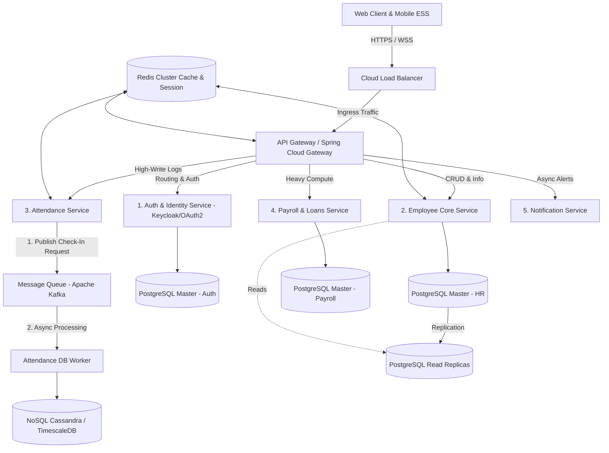

# Enterprise HRIS Architecture & Scalable System Design

[](https://spring.io/projects/spring-boot)
[-blue?logo=react&logoColor=white)](https://react.dev/)
[](https://reactnative.dev/)
[](https://www.postgresql.org/)
[](https://redis.io/)
[](https://kafka.apache.org/)
[](https://www.docker.com/)
[](https://kubernetes.io/)
[](https://www.jenkins.io/)

A brand-neutral, cloud-native, and highly scalable **Enterprise Human Resource Information System (HRIS)** blueprint designed to support **millions of active users** with high write throughput, zero-downtime deployments, and complex relational workflows (Payroll, Tax compliance, Loans, Claims, and OKRs).

---

## 📌 Table of Contents
1. [System Topology & Architecture](#-system-topology--architecture)
2. [Database Schema (42 Tables ERD)](#-database-schema-42-tables-erd)
3. [Key Scalability & Resilience Design Patterns](#-key-scalability--resilience-design-patterns)
4. [Enterprise Core Modules](#-enterprise-core-modules)
5. [Monorepo Directory Structure](#-monorepo-directory-structure)
6. [CI/CD Pipeline Workflow (Jenkins)](#-cicd-pipeline-workflow-jenkins)
7. [Getting Started (Local Development)](#-getting-started-local-development)

---

## 🏗 System Topology & Architecture

This architecture implements a containerized, decoupled **Microservices Pattern** powered by **Spring Cloud Gateway** and **Keycloak** to handle high traffic and avoid the bottlenecks of legacy monolithic setups.



---

## 📊 Database Schema (42 Tables ERD)

To support the massive structural breadth of an enterprise HRIS, the database schema is divided into **42 highly structured tables** ensuring data consistency and strict optionality/cardinality constraints.

```mermaid
erDiagram
    %% Core HR Base & Auth
    USERS }o--|| ROLES : "has role"
    EMPLOYEE ||--o| USERS : "has login account"
    EMPLOYEE }o--|| DEPARTMENTS : "belongs to"
    EMPLOYEE }o--|| JOBS : "holds position"
    EMPLOYEE ||--o{ EMPLOYEE_SALARY_HISTORY : "has salary changes"
    EMPLOYEE ||--o| EMPLOYEE_BANK_DETAILS : "has payout account"
    EMPLOYEE ||--o{ EMPLOYEE_DOCUMENTS : "submits verification"
    
    %% Core Operations, Geofencing, & Shifts
    EMPLOYEE ||--o{ ATTENDANCES : "records clock-in/out"
    ATTENDANCES }o--|| ATTENDANCE_LOCATIONS : "validated at"
    EMPLOYEE ||--o{ WORK_SCHEDULES : "has allocated"
    SHIFTS ||--o{ WORK_SCHEDULES : "defines shift for"
    EMPLOYEE ||--o{ LEAVE_REQUESTS : "submits time-off"
    EMPLOYEE ||--o{ LEAVE_BALANCES : "has quota"
    EMPLOYEE ||--o{ PAYROLLS : "receives monthly"
    PAYROLLS ||--o{ PAYROLL_DETAILS : "contains breakdown"
    
    %% System Utilities & Workflows
    EMPLOYEE ||--o{ AUDIT_LOGS : "generates"
    EMPLOYEE ||--o{ NOTIFICATIONS : "receives"
    APPROVAL_ROUTES ||--o{ APPROVAL_LOGS : "guides"
    EMPLOYEE ||--o{ APPROVAL_LOGS : "acts as approver/requester"
    
    %% Loans Module
    EMPLOYEE ||--o{ LOAN_REQUESTS : "submits"
    LOAN_REQUESTS ||--o{ LOAN_INSTALLMENTS : "has schedule"
    LOAN_INSTALLMENTS }o--o| PAYROLLS : "deducted in"
    
    %% Claims Module
    EMPLOYEE ||--o{ CLAIM_REQUESTS : "submits receipt"
    CLAIM_CATEGORIES ||--o{ CLAIM_REQUESTS : "categorizes"
    EMPLOYEE ||--o{ CLAIM_BALANCES : "has allocation"
    CLAIM_CATEGORIES ||--o{ CLAIM_BALANCES : "defines limit for"
    
    %% Attendance Correction (ESS)
    EMPLOYEE ||--o{ ATTENDANCE_CHANGE_REQUESTS : "requests correction"
    
    %% OKRs Module
    EMPLOYEE ||--o{ OKR_OBJECTIVES : "owns target"
    OKR_OBJECTIVES ||--o{ OKR_KEY_RESULTS : "contains measurable"
    
    %% Project Management
    PROJECTS ||--o{ PROJECT_MEMBERS : "allocates"
    EMPLOYEE ||--o{ PROJECT_MEMBERS : "participates"
    PROJECTS ||--o{ PROJECT_TASKS : "contains project"
    PROJECT_TASKS ||--o| EMPLOYEE : "assigned to"
    
    %% Performance Reviews
    EMPLOYEE ||--o{ PERFORMANCE_REVIEWS : "evaluated in"
    
    %% Recruitment & Manpower Planning
    DEPARTMENTS ||--o{ MANPOWER_REQUISITIONS : "requests headcount"
    JOBS ||--o{ JOB_POSTINGS : "recruiting for"
    JOB_POSTINGS ||--o{ APPLICANTS : "receives CV from"
    APPLICANTS ||--o{ RECRUITMENT_STAGES : "passes through"
    
    %% L&D Training
    TRAINING_COURSES ||--o{ EMPLOYEE_TRAININGS : "offers course"
    EMPLOYEE ||--o{ EMPLOYEE_TRAININGS : "attends"
```



---

## ⚡ Key Scalability & Resilience Design Patterns

### 1. Asynchronous Write-Behind Caching (Apache Kafka)
*   **The Problem**: During morning clock-in peaks (07:30 - 08:30 AM), millions of concurrent database writes lock standard relational databases.
*   **Our Solution**: The `attendance-service` validates coordinate metrics via Redis, immediately issues a `200 OK` (within **20ms**) back to the mobile client, and pushes a `clockin` event to **Apache Kafka**. A background database worker processes events asynchronously in batches, protecting the database from traffic spikes.

### 2. High-Performance Caching (Redis Cluster)
*   Active user session states (JWT blocklist), geofencing office coordinates, and system configurations are cached with a **volatile-lru** eviction policy. This reduces primary database read queries by **up to 90%**.

### 3. Database Partitioning (Polyglot Persistence)
*   **Transactional Core**: Powered by **PostgreSQL** to maintain strict **ACID compliance** for salary distributions and loan contracts.
*   **Append-Only Logs**: High-volume log data (`attendances`, `audit_logs`) is routed to **TimescaleDB** (time-series extension) to sustain high write rates without impacting core transactions.

### 4. Zero-Downtime Deployment
*   Supports rolling updates and **Blue-Green Deployments** on **Kubernetes (K8s)** using horizontal pod autoscaling (HPA) to scale replicas dynamically when CPU utilization exceeds **70%**.

---

## 📦 Enterprise Core Modules
1.  **HR Base & Auth**: Core biodata, organizational hierarchies, multi-tenant roles, and security audit trails.
2.  **Payroll & Tax Engine**: Automated calculation of base salaries, variable allowances, loan amortization deductions, BPJS, and PPh 21 progressive income taxes.
3.  **Attendance & Geofencing**: Real-time geolocation check-in/out validated within custom geofence radii.
4.  **Workflows & Approvals**: Hierarchical, multi-level route approvals for claims, loans, and leaves.
5.  **Employee Loans**: Comprehensive amortization schedules with automatic payroll deductions.
6.  **Reimbursements & Claims**: Automated balance tracking per category with receipt validation workflows.
7.  **OKR Tracker**: Align individual Key Results with company-wide Objectives.
8.  **Project Management**: Employee workload monitoring, project assignment, and task progress tracking.
9.  **Recruitment (ATS)**: Manpower planning, job board postings, CV applications, and recruitment stage tracking.
10. **Learning & Development (L&D)**: Professional development courses, training sessions, and grading metrics.

---

## 📂 Monorepo Directory Structure

This project uses a clean monorepo architecture to keep backend services, web portals, mobile application, and deployments synchronized.

```text
human-resource-management-system/
├── backend/                        # Java Spring Boot Microservices
│   ├── pom.xml                     # Maven Parent configuration
│   ├── api-gateway/                # Spring Cloud API Gateway (Port 8000)
│   ├── auth-service/               # Keycloak Security Integration (Port 8010)
│   ├── employee-service/           # Core Employee & Org service (Port 8020)
│   ├── attendance-service/         # Geofencing Clock-in/out engine (Port 8030)
│   ├── payroll-service/            # Payroll calculation & tax engine (Port 8040)
│   └── notification-service/       # Event-driven mail & push notifier (Port 8050)
├── frontend-web/                   # Web Dashboard (React.js + Vite)
├── frontend-mobile/                # Mobile App (React Native or Flutter)
├── docker/                         # Docker Compose configuration files
│   └── docker-compose.yml          # Local orchestration of all services
├── docs/                           # Comprehensive System Analysis
│   ├── ANALYSIS_HRIS_ENTERPRISE.md # Database relational detailed specs
│   └── SCALABLE_ARCHITECTURE_DESIGN.md # Multi-cluster, caching, and queue specs
└── Jenkinsfile                     # Declarative CI/CD pipeline script
```

---

## 🚀 Getting Started (Local Development)

### Prerequisites
*   [Docker & Docker Compose](https://docs.docker.com/engine/install/)
*   [Java 17 JDK](https://openjdk.org/projects/jdk/17/) (For backend compiles)
*   [Node.js 18+](https://nodejs.org/) (For frontend compilation)

### Run Infrastructure Stack
Initialize all microservices, databases (PostgreSQL, TimescaleDB), Redis, and Apache Kafka in one command:
```bash
# Clone the repository
git clone https://github.com/bintangmada/human-resource-management-system.git
cd human-resource-management-system

# Start database, cache, broker, and microservices
docker compose -f docker/docker-compose.yml up -d
```

### Validate Deployment Status
Check if all microservices and databases are up and running:
```bash
docker compose -f docker/docker-compose.yml ps
```
The API Gateway will be accessible at `http://localhost:8000` and React Web Dashboard at `http://localhost:3000`.

---

## 📄 License
This project is open-source and available under the [MIT License](LICENSE).
