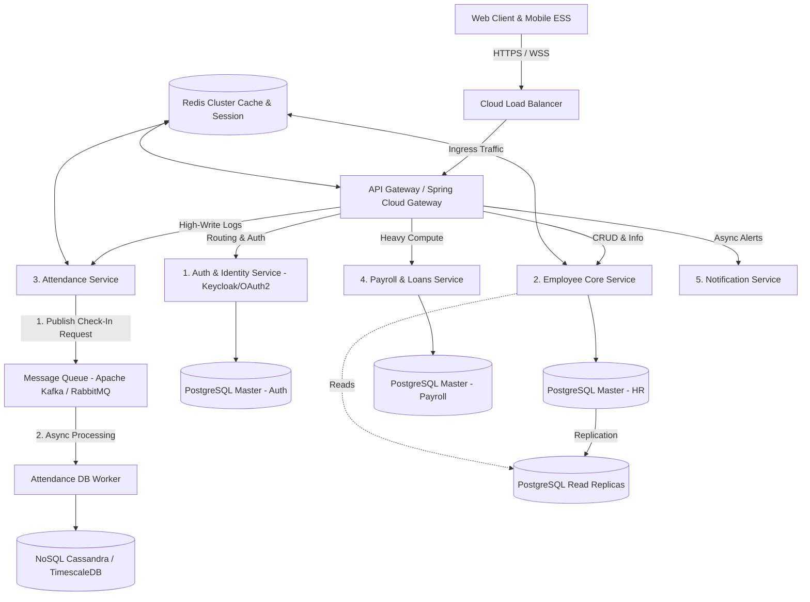

# Perancangan Arsitektur HRIS Skala Jutaan Pengguna
> Dokumen ini menjelaskan rancangan arsitektur sistem, infrastruktur, dan strategi penskalaan (*scaling*) untuk **APLIKASI HR** agar mampu melayani ribuan hingga jutaan pengguna dengan tingkat ketersediaan tinggi (*High Availability*) dan downtime minimal (menuju 99.99% uptime).

---

## 1. Topologi Arsitektur Sistem (Microservices Pattern)
Untuk sistem yang melayani jutaan pengguna, arsitektur **Monolith** konvensional akan menghadapi batas kemampuan scaling (kemacetan pada satu database dan beban CPU terpusat). Kita merancang sistem dengan pola **Microservices** berbasis kontainer.



---

## 1.1 Daftar Komprehensif Teknologi & Analisis Stack

Berikut adalah analisis mendalam mengenai seluruh teknologi (*tech stack*) yang digunakan dalam rancangan arsitektur HRIS Enterprise ini, lengkap dengan peran, alasan pemilihan, kelebihan, serta kekurangannya.

### 1. Backend: Java Spring Boot (Microservices API)
*   **Peran**: Kerangka kerja utama untuk pengembangan seluruh REST API Microservices.
*   **Alasan Pemilihan**: Standar industri emas untuk aplikasi skala *Enterprise* yang membutuhkan keandalan tinggi, keamanan ketat, dan manajemen transaksi database yang matang (melalui Hibernate/JPA).
*   **Kelebihan**:
    *   Ekosistem sangat luas dengan dukungan pustaka (*libraries*) out-of-the-box yang melimpah (Spring Security, Spring Cloud Gateway, JPA).
    *   *Type-safe* (bahasa Java) mengurangi kesalahan penulisan kode pada sistem besar.
    *   Manajemen multi-threading dan koneksi database yang sangat stabil untuk konkurensi tinggi.
*   **Kekurangan**:
    *   Penggunaan memori (RAM) awal cukup besar saat *startup* (*high memory footprint*) dibanding Go atau Node.js.
    *   Waktu *cold start* (booting pertama) relatif lambat.

### 2. Database Utama: PostgreSQL (Relational DB)
*   **Peran**: Penyimpanan utama untuk data transaksional yang kritikal (Biodata, Gaji, Pinjaman, Cuti, Alur Persetujuan).
*   **Alasan Pemilihan**: Menawarkan jaminan kepatuhan transaksi ACID yang ketat dan kemampuan kueri relasional (seperti rekursif untuk struktur organisasi) yang sangat baik secara gratis.
*   **Kelebihan**:
    *   100% open-source tanpa biaya lisensi core CPU.
    *   Dukungan tipe data spasial (PostGIS) untuk absensi dan data semi-terstruktur (JSONB dengan indeks GIN) yang sangat cepat.
    *   Skalabilitas pembacaan data yang matang melalui *Read Replicas*.
*   **Kekurangan**:
    *   Penskalaan penulisan (*write scaling*) membutuhkan teknik kompleks seperti database sharding jika volume data meledak.
    *   Membutuhkan konfigurasi *connection pooling* tambahan (misal PgBouncer) jika jumlah koneksi microservices sangat banyak.

### 3. Database Log: TimescaleDB / Apache Cassandra (NoSQL/Time-Series)
*   **Peran**: Menyimpan log harian absensi GPS (`attendances`) dan audit sistem (`audit_logs`) dalam volume sangat besar.
*   **Alasan Pemilihan**: Mencegah tabel utama PostgreSQL membengkak (miliar baris) yang dapat memperlambat kueri payroll dan absensi harian.
*   **Kelebihan**:
    *   Dapat menangani ribuan kueri tulis (*write throughput*) per detik secara konstan tanpa *locking*.
    *   Pembersihan data log lama (*data retention*) sangat mudah dan otomatis.
*   **Kekurangan**:
    *   Menambah kompleksitas arsitektur karena developer harus memelihara dua tipe database berbeda.
    *   Tidak cocok untuk query relasional yang membutuhkan banyak *JOIN* antar tabel transaksional.

### 4. Cache & Session: Redis Cluster (In-Memory DB)
*   **Peran**: Menyimpan sesi user, daftar hitam token JWT (*blacklist*), dan *caching* konfigurasi/profil karyawan.
*   **Alasan Pemilihan**: Memotong beban baca ke PostgreSQL dengan mengembalikan data dalam hitungan milidetik langsung dari memori RAM.
*   **Kelebihan**:
    *   Kecepatan baca-tulis luar biasa (< 5 milidetik).
    *   Mendukung berbagai struktur data (String, Hash, List, Set, Geo) secara bawaan.
*   **Kekurangan**:
    *   Data disimpan di RAM, sehingga biaya pembesaran kapasitas (*scaling RAM*) lebih mahal daripada disk penyimpanan biasa.
    *   Data bisa hilang jika server mati mendadak (jika konfigurasi persistensi AOF/RDB tidak diaktifkan).

### 5. Message Queue: Apache Kafka (Event Broker)
*   **Peran**: Penyangga antrean tulis absensi pagi hari (*write-behind buffer*) dan broker komunikasi antar-servis (event-driven).
*   **Alasan Pemilihan**: Menjamin tidak ada request absensi karyawan yang hilang/gagal saat jam sibuk masuk kantor (kemacetan traffic).
*   **Kelebihan**:
    *   *Throughput* pesan yang sangat tinggi (jutaan pesan per detik).
    *   Pesan disimpan di disk secara persisten (bisa diputar ulang/*replay* jika worker mengalami crash).
*   **Kekurangan**:
    *   Konfigurasi awal dan pemeliharaan kluster Kafka (zookeeper/kraft) tergolong rumit.
    *   Terlalu berat untuk sistem berskala kecil jika hanya digunakan untuk antrean sederhana.

### 6. Orchestration: Kubernetes & Docker
*   **Peran**: standardisasi kontainer aplikasi (Docker) dan manajemen orkestrasi otomatisasi server (Kubernetes).
*   **Alasan Pemilihan**: Memungkinkan auto-scaling otomatis berdasarkan beban CPU (`Horizontal Pod Autoscaler`) untuk meminimalisasi downtime.
*   **Kelebihan**:
    *   *Self-healing*: Kubernetes otomatis merestart kontainer aplikasi yang error/mati.
    *   *Cloud-agnostic*: Aplikasi dapat dipindahkan dari AWS, GCP, ke VPS pribadi tanpa mengubah konfigurasi kode.
*   **Kekurangan**:
    *   *Steep learning curve*: Konfigurasi Kubernetes (manifest YAML, ingress, network policy) sangat rumit untuk pemula.
    *   Memerlukan resource server manager (Control Plane) yang cukup memakan RAM/CPU.

### 7. CI/CD Automation: Jenkins
*   **Peran**: Mengotomatiskan alur compile, unit test, build docker image, dan deploy ke server target secara berkala.
*   **Alasan Pemilihan**: Alat CI/CD standar industri yang paling fleksibel karena memiliki ribuan plugin integrasi dan dapat diinstal mandiri di VPS gratisan.
*   **Kelebihan**:
    *   Sepenuhnya gratis dan open-source.
    *   Sangat kustomisasi melalui *Declarative Pipeline* (`Jenkinsfile`).
*   **Kekurangan**:
    *   Antarmuka pengguna (UI) terasa jadul.
    *   Tanggung jawab keamanan dan pembaruan sistem ada pada tangan developer sendiri (dibandingkan cloud SaaS seperti GitHub Actions).

### 8. Frontend Web: React.js (Vite)
*   **Peran**: Membangun portal web utama untuk HR Admin, Manager, dan Recruitment ATS.
*   **Alasan Pemilihan**: React memberikan performa render halaman yang cepat berbasis Single Page Application (SPA). Menggunakan bundler modern **Vite** untuk waktu build yang super cepat dan performa optimal selama pengembangan.
*   **Kelebihan**:
    *   Komponen antarmuka (UI) bersifat *reusable* (bisa digunakan kembali), mempercepat pengembangan kode.
    *   Ekosistem UI Component Library (seperti TailwindCSS, Shadcn/ui, Ant Design) yang sangat melimpah untuk membuat tampilan premium.
    *   Virtual DOM membuat perpindahan halaman tanpa *reload* penuh yang sangat mulus bagi admin.
*   **Kekurangan**:
    *   Sebagai SPA, inisialisasi awal (*Initial Page Load*) memerlukan waktu untuk men-download file Javascript bundle sebelum halaman dirender.
    *   Kurang optimal untuk Search Engine Optimization (SEO) di portal publik dibanding SSR (Server-Side Rendering), sehingga data lowongan kerja umum (`job_postings`) disarankan dikueri secara dinamis atau didistribusikan ke agregator eksternal.

### 9. Frontend Mobile: React Native / Flutter
*   **Peran**: Membangun aplikasi mobile untuk ESS Karyawan (Absensi GPS, pengajuan cuti, klaim benefit).
*   **Alasan Pemilihan**: Pengembangan lintas platform (*cross-platform*) sehingga dengan satu basis kode (Javascript/Dart) dapat menghasilkan aplikasi Android dan iOS sekaligus, menghemat biaya tim pengembang.
*   **Kelebihan**:
    *   Menghemat waktu development hingga 50% dibanding menulis native Android (Kotlin) dan iOS (Swift) terpisah.
    *   Performa rendering UI yang sangat mulus mendekati aplikasi native asli.
    *   Dukungan penuh untuk fitur geolokasi GPS, kamera (scan struk klaim), dan notifikasi HP.
*   **Kekurangan**:
    *   Untuk beberapa fitur yang sangat bergantung pada hardware native versi terbaru, developer terkadang harus menulis modul jembatan (*native bridge*) manual.
    *   Ukuran aplikasi (*app size*) sedikit lebih besar daripada aplikasi native murni.

### 10. API Gateway & Auth: Spring Cloud Gateway & Keycloak
*   **Peran**: Gerbang masuk tunggal (*Single Entry Point*) untuk mengamankan, merutekan kueri, dan memproses otentikasi (OAuth2 / JWT).
*   **Alasan Pemilihan**: Memisahkan logika otentikasi keamanan dari modul fungsional sehingga kode mikroservis tetap bersih dan terlindungi dari akses ilegal.
*   **Kelebihan**:
    *   Keycloak menyediakan fitur keamanan siap pakai tingkat enterprise (2FA, Social Login, SSO) secara gratis.
    *   Spring Cloud Gateway dapat menangani pembatasan laju kueri (*Rate Limiting*) untuk mencegah serangan DDoS.
*   **Kekurangan**:
    *   Merupakan titik krusial kegagalan (*Single Point of Failure*) jika tidak dideploy dengan redundansi tinggi (minimal 2 replika pod aktif).
    *   Menambahkan overhead latensi jaringan kecil karena semua kueri harus melewati Gateway terlebih dahulu.

---

## 2. Strategi Auto-Scaling (Infrastruktur)
Untuk otomatisasi penskalaan server guna meminimalisasi downtime, kita menggunakan ekosistem **Cloud-Native Kubernetes (K8s)** (seperti AWS EKS, GCP GKE, atau Azure AKS) dengan strategi berikut:

### A. Horizontal Pod Autoscaler (HPA)
* **Cara Kerja**: Kubernetes memantau metrik penggunaan CPU dan Memori pada setiap replika aplikasi (*Pod*).
* **Konfigurasi**: Jika penggunaan CPU rata-rata melewati **70%**, Kubernetes otomatis meluncurkan replika kontainer baru dalam hitungan detik.
* **Kasus Nyata**: Modul *Attendance Service* akan otomatis *scale-up* dari 3 pod menjadi 50 pod pada pukul 07:30 - 08:30 pagi (saat jutaan karyawan masuk kerja secara bersamaan), lalu kembali menyusut menjadi 3 pod pada siang hari untuk menghemat biaya server.

### B. Cluster Autoscaler
* **Cara Kerja**: Jika pod aplikasi bertambah sangat banyak hingga kapasitas server fisik/Virtual Machine (Node) habis, Cluster Autoscaler akan memerintahkan provider cloud (AWS/GCP) untuk menyalakan VM baru secara otomatis (*Node Auto-Provisioning*).

### C. Serverless untuk Batch Job (Payroll)
* Perhitungan payroll bulanan untuk jutaan orang membutuhkan daya komputasi CPU yang sangat besar tetapi hanya berjalan 1-2 kali sebulan.
* **Rancangan**: Alih-alih menyalakan server besar 24/7, kita meluncurkan task payroll menggunakan **AWS ECS Fargate** atau **Knative** yang berskala secara dinamis, melakukan komputasi paralel, lalu langsung mati setelah selesai.

---

## 3. Strategi Menghindari Database Bottleneck (Skala Jutaan User)
Masalah terbesar sistem skala besar bukan pada server aplikasi, melainkan pada **database**. Berikut cara mengatasinya:

### A. Pemisahan Tipe Database (Polyglot Persistence)
* **Core HR & Payroll (Relational DB - PostgreSQL)**: Membutuhkan jaminan transaksi yang ketat (ACID Compliance) agar nominal gaji dan data pinjaman tidak pernah salah.
* **Attendance Logs (Time-Series/NoSQL - TimescaleDB / Apache Cassandra)**: Menyimpan miliaran log koordinat GPS dan *timestamp*. Database relasional biasa akan lambat jika tabelnya berisi ratusan juta baris. NoSQL atau Time-Series DB dirancang khusus untuk menulis jutaan data log per detik dengan sangat cepat.

### B. Read-Write Splitting & Database Sharding
* **Read-Write Splitting**: Operasi tulis (misal: pengajuan klaim/absen) diarahkan ke *Primary Database*, sedangkan operasi baca (misal: karyawan melihat slip gaji, manager melihat dashboard) diarahkan ke beberapa *Read Replicas* secara paralel.
* **Database Sharding**: Membagi data berdasarkan ID Perusahaan (SaaS Multi-tenant). Data Perusahaan A disimpan di Server Database 1, Perusahaan B di Server Database 2.

### C. Message Queue untuk Buffer Penulisan (Asynchronous Write-Behind)
Ketika 500,000 karyawan melakukan *clock-in* di menit yang sama, database akan mengalami *lock* jika kita menulisnya secara sinkron.
* **Solusi**: 
  1. Karyawan melakukan absen -> Server memvalidasi lokasi GPS & menyimpannya di **Redis Cache** -> Mengirim respon sukses ke HP Karyawan (kecepatan respon < 50ms).
  2. Server mengirim pesan event `employee.checked_in` ke **Apache Kafka**.
  3. Worker database membaca pesan dari Kafka secara bertahap (misal 5,000 baris per detik) untuk disimpan secara permanen di database utama. Database aman dari lonjakan traffic.

---

## 4. Minimasi Downtime & Deployments (Zero Downtime)
Untuk memastikan tidak ada downtime saat tim developer merilis update fitur baru:

1. **Blue-Green Deployment**:
   * Menyiapkan dua lingkungan produksi: **Blue** (aktif saat ini) dan **Green** (versi baru yang dideploy).
   * Keduanya berjalan bersamaan. Setelah versi Green lolos uji coba, *Load Balancer* secara instan mengalihkan 100% lalu lintas ke lingkungan Green. Jika ada error, rollback bisa dilakukan instan dengan mengembalikan lalu lintas ke Blue.
2. **Circuit Breaker (Resilience4j / Istio Service Mesh)**:
   * Jika modul *Payroll* sedang mengalami error/gangguan, sistem tidak boleh mati total. Modul lain seperti *Attendance* dan *HR Base* harus tetap berjalan normal. Pintu gerbang API Gateway akan mendeteksi servis yang rusak dan menampilkan *graceful fallback response* kepada pengguna.
3. **Database Migrations Safely**:
   * Melakukan migrasi database dengan prinsip *Expand and Contract*. Kolom baru dideklarasikan tanpa menghapus kolom lama agar aplikasi versi lama dan baru dapat berjalan bersamaan selama masa transisi.

---

## 5. Ringkasan Kunci Kemudahan Pemeliharaan (Maintainability)
* **Monorepo / Clean Architecture**: Setiap service ditulis dengan prinsip *Domain-Driven Design (DDD)* dengan batasan konteks (*Bounded Context*) yang jelas. Perubahan di satu modul tidak akan merusak modul lainnya.
* **CI/CD Pipeline Otomatis**: Setiap push kode ke repositori utama akan melalui proses testing otomatis, pemindaian celah keamanan (SAST), build Docker image, dan auto-deploy ke kluster Kubernetes.
* **Distributed Tracing (OpenTelemetry + Jaeger/Prometheus)**: Memantau jalannya satu request dari aplikasi pengguna yang melewati beberapa microservices untuk mendeteksi bottleneck dengan cepat.

---

## 6. Spesifikasi Detail Implementasi Redis & Apache Kafka

Untuk memastikan integritas dan performa sistem berskala jutaan pengguna, berikut adalah spesifikasi teknis penerapan **Redis Cluster** dan **Apache Kafka Cluster**.

### A. Skema Caching & Struktur Data Redis

Redis dikonfigurasi sebagai cluster multi-node dengan replikasi aktif. Kebijakan pengosongan memori (*cache eviction policy*) menggunakan `volatile-lru` (Least Recently Used untuk key yang memiliki TTL).

#### 1. Aturan Penamaan Key & TTL (Time To Live)
| Kategori Data | Format Key | Tipe Data Redis | TTL | Strategi Invalidation |
| :--- | :--- | :--- | :--- | :--- |
| **User Session (JWT)** | `auth:session:{userId}` | `String (JSON)` | 24 Jam | Di-delete saat user melakukan logout. |
| **Profil Dasar Karyawan** | `employee:profile:{employeeId}` | `Hash` | 1 Jam | *Cache-Aside*: Di-update/delete saat ada *event* update karyawan. |
| **Konfigurasi Global** | `settings:global` | `Hash` | 24 Jam | *Write-Through*: Otomatis di-update oleh admin lewat portal Web. |
| **Geofencing Kantor** | `geofence:location:{locationId}`| `Hash` | 12 Jam | Di-update jika ada perubahan koordinat kantor cabang. |
| **Jatah Saldo Cuti** | `leave:balance:{employeeId}` | `Hash` | 30 Menit| Dihapus instan ketika ada pengajuan cuti yang disetujui. |

#### 2. Contoh Struktur Data Cache (Geofence Location)
```bash
# Perintah Redis untuk menyimpan data lokasi kantor
HMSET geofence:location:LOC_001 name "Kantor Pusat Jakarta" lat -6.175110 lng 106.827120 radius_meters 100 status "ACTIVE"
EXPIRE geofence:location:LOC_001 43200
```

---

### B. Topologi & Aliran Data Apache Kafka

Kafka dikonfigurasi dengan minimal **3 Broker** untuk menjaga toleransi kesalahan (*fault tolerance*). Setiap topik penting memiliki *replication factor* = 3 dan kunci partisi berbasis `employee_id` atau `tenant_id` untuk menjamin urutan pesan yang konsisten per karyawan.

```
                  +----------------------------------------------+
                  |  Mobile App (Karyawan melakukan Clock-In)    |
                  +----------------------------------------------+
                                         |
                                         v (HTTP POST /api/attendance/clockin)
                  +----------------------------------------------+
                  |       [Pod] Attendance Service (Fast GW)     |
                  +----------------------------------------------+
                                         |
                                         | 1. Validasi GPS & Radius via Redis Cache
                                         | 2. Kirim pesan sukses instan ke HP (< 20ms)
                                         v
                  +----------------------------------------------+
                  |  Kafka Topic: employee.attendance.clockin    |
                  +----------------------------------------------+
                                         |
                                         | (Async Consumer Group)
                                         v
                  +----------------------------------------------+
                  |    [Pod] Attendance-DB-Worker (Consumer)     |
                  +----------------------------------------------+
                                         |
                                         v (Bulk Write 2000 msgs/batch)
                  +----------------------------------------------+
                  |     TimeSeries Database (TimescaleDB)        |
                  +----------------------------------------------+
```

#### 1. Konfigurasi Topik (Topics Configuration)
*   **`employee.attendance.clockin`**:
    *   *Partitions*: 12 (untuk menangani *throughput* 20.000 pesan/detik).
    *   *Replication Factor*: 3.
    *   *Cleanup Policy*: `delete` (retensi data 7 hari).
*   **`employee.leave.submitted`**:
    *   *Partitions*: 3.
    *   *Replication Factor*: 3.
*   **`notification.dispatch`**:
    *   *Partitions*: 6 (menggunakan antrean untuk push notification HP dan email).
    *   *Replication Factor*: 3.

#### 2. Skema Payload Pesan (JSON)

##### Event: `employee.attendance.clockin` (Dikirim ke topik Kafka setelah validasi GPS sukses)
```json
{
  "event_id": "evt_883a992d-88b1-4bc5-a120",
  "event_type": "EMPLOYEE_CLOCKED_IN",
  "timestamp": "2026-06-18T08:00:03Z",
  "payload": {
    "employee_id": "EMP_992811",
    "schedule_id": "SCHED_20260618",
    "shift_id": "SHIFT_MORNING",
    "clock_in_time": "08:00:01",
    "latitude": -6.175105,
    "longitude": 106.827115,
    "location_id": "LOC_001",
    "device_signature": "iPhone15,3-iOS17.2",
    "status": "PRESENT",
    "is_late": false,
    "late_duration_minutes": 0
  }
}
```

##### Event: `employee.leave.submitted` (Memicu pembuatan log approval dan push notifikasi ke manager)
```json
{
  "event_id": "evt_772c118e-990a-4bb2-cc91",
  "event_type": "LEAVE_REQUEST_SUBMITTED",
  "timestamp": "2026-06-18T10:15:30Z",
  "payload": {
    "request_id": "REQ_LV_202606001",
    "employee_id": "EMP_992811",
    "manager_id": "EMP_110293",
    "leave_type_id": "LV_ANNUAL",
    "start_date": "2026-07-01",
    "end_date": "2026-07-03",
    "total_days": 3,
    "notes": "Keperluan keluarga di luar kota"
  }
}
```

---

## 7. Desain Alur CI/CD menggunakan Jenkins

Untuk mengotomatiskan proses pengujian, pengemasan (*packaging*), dan peluncuran (*deployment*) aplikasi ke server VPS atau kluster Kubernetes, kita mengimplementasikan jalur **CI/CD Pipeline** menggunakan Jenkins.

### A. Diagram Aliran CI/CD (Pipeline Flow)

```
 [Developer] -> Push Code -> [GitHub Repo]
                                   |
                         (Webhook Trigger CI)
                                   v
                             [Jenkins Server]
                                   |
        +--------------------------+--------------------------+
        |                                                     |
        | 1. Checkout Code                                    |
        | 2. Build & Test (Maven: mvn clean package)          |
        | 3. Code Analysis (SonarQube)                        |
        | 4. Build Docker Image & Tagging                     |
        | 5. Push Image to Docker Registry / ECR              |
        |                                                     |
        +--------------------------+--------------------------+
                                   |
                         (Automatic Deployment)
                                   v
             +---------------------+---------------------+
             | (Pilihan A: Dev VPS)                      | (Pilihan B: Prod K8s)
             | SSH & Run Docker Compose                  | Kubectl Rolling Update
             +-------------------------------------------+
```

---

### B. Template Jenkinsfile (Declarative Pipeline)

Berikut adalah contoh rancangan file konfigurasi `Jenkinsfile` yang akan diletakkan di akar proyek (*root project*) GitHub Anda untuk dijalankan oleh Jenkins:

```groovy
pipeline {
    agent any

    environment {
        // Nama image dan registry
        DOCKER_REGISTRY = "docker.io/bintangmada" // Ganti sesuai akun Docker Hub Anda
        IMAGE_NAME      = "hris-backend"
        IMAGE_TAG       = "${env.BUILD_NUMBER}" // Menggunakan nomor build sebagai tag versi
        
        // Kredensial Jenkins
        DOCKER_HUB_CREDS = 'docker-hub-credentials-id'
        VPS_SSH_CREDS    = 'vps-ssh-credentials-id'
        VPS_IP           = '192.168.1.100' // IP VPS development Anda
    }

    stages {
        stage('1. Checkout Code') {
            steps {
                checkout scm
            }
        }

        stage('2. Build & Unit Test') {
            steps {
                sh 'mvn clean package -DskipTests=false'
            }
            post {
                success {
                    // Menyimpan hasil unit test reports
                    junit '**/target/surefire-reports/*.xml'
                }
            }
        }

        stage('3. Static Code Analysis') {
            steps {
                // Melakukan analisis keamanan dan bugs menggunakan SonarQube
                echo 'Running SonarQube Code Analysis...'
                // withSonarQubeEnv('SonarQubeServer') {
                //     sh 'mvn sonar:sonar'
                // }
            }
        }

        stage('4. Build Docker Image') {
            steps {
                script {
                    echo "Building Docker Image for ${IMAGE_NAME}:${IMAGE_TAG}..."
                    sh "docker build -t ${DOCKER_REGISTRY}/${IMAGE_NAME}:${IMAGE_TAG} ."
                    sh "docker tag ${DOCKER_REGISTRY}/${IMAGE_NAME}:${IMAGE_TAG} ${DOCKER_REGISTRY}/${IMAGE_NAME}:latest"
                }
            }
        }

        stage('5. Push Image to Registry') {
            steps {
                script {
                    // Login ke Docker Hub secara aman menggunakan kredensial Jenkins
                    withCredentials([usernamePassword(credentialsId: DOCKER_HUB_CREDS, usernameVariable: 'USER', passwordVariable: 'PASS')]) {
                        sh "echo \$PASS | docker login -u \$USER --password-stdin"
                        sh "docker push ${DOCKER_REGISTRY}/${IMAGE_NAME}:${IMAGE_TAG}"
                        sh "docker push ${DOCKER_REGISTRY}/${IMAGE_NAME}:latest"
                    }
                }
            }
        }

        stage('6. Deploy to Development VPS') {
            steps {
                script {
                    echo "Deploying to VPS at ${VPS_IP}..."
                    // Menggunakan SSH Agent untuk mengupdate image Docker baru di VPS development
                    sshagent(credentials: [VPS_SSH_CREDS]) {
                        sh """
                            ssh -o StrictHostKeyChecking=no root@${VPS_IP} '
                                cd /app/hris-deployment &&
                                docker compose pull &&
                                docker compose up -d --no-deps hris-backend &&
                                docker image prune -f
                            '
                        """
                    }
                }
            }
        }
    }

    post {
        always {
            // Pembersihan workspace agar disk space server Jenkins tidak penuh
            cleanWs()
        }
        success {
            echo "CI/CD Pipeline Selesai dengan Sukses!"
        }
        failure {
            echo "CI/CD Pipeline Gagal. Silakan periksa log Jenkins."
        }
    }
}
```

---

### C. Keunggulan Desain CI/CD ini untuk VPS Anda:
1. **Otomatisasi Penuh (Fully Automated)**: Begitu Anda melakukan `git push` ke repositori GitHub, webhook memicu Jenkins untuk langsung build dan deploy. Anda tidak perlu menyentuh terminal VPS lagi.
2. **Kredensial Aman (Security Best Practice)**: Kata sandi Docker Hub dan kunci SSH privat VPS disimpan di dalam Jenkins Credentials Store (tidak ditulis langsung dalam kode), menjamin keamanan server Anda.
3. **Zero-Downtime Ringan (No-Deps Restart)**: Menggunakan flag `docker compose up -d --no-deps hris-backend` di VPS. Ini akan mematikan kontainer versi lama dan menyalakan kontainer versi baru secara instan dalam waktu 1-2 detik tanpa perlu mematikan database PostgreSQL atau Redis, meminimalkan waktu jeda aplikasi.
