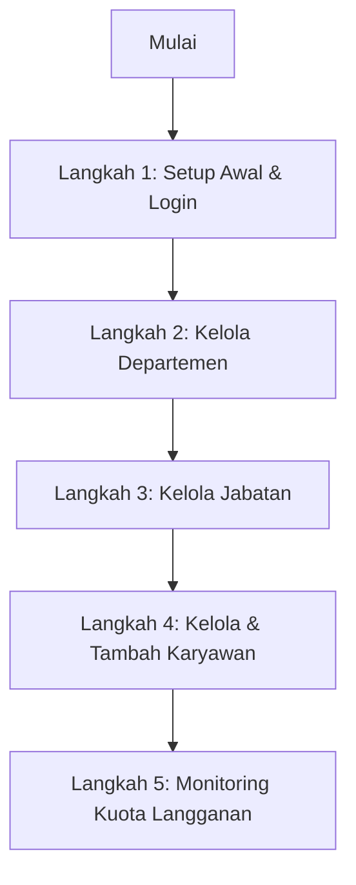
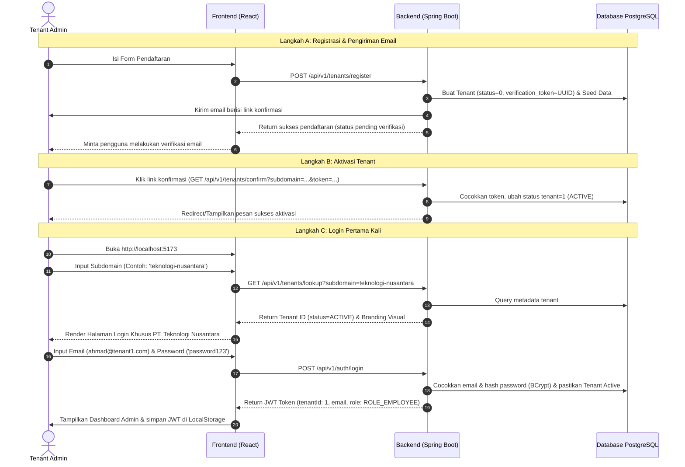
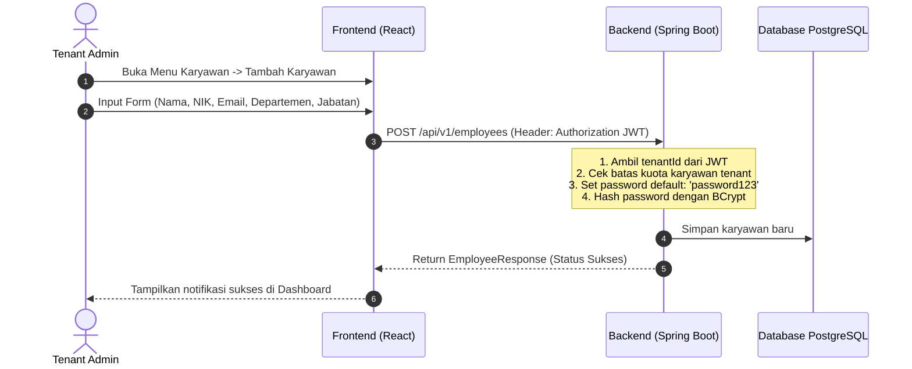

# Dokumen Alur Kerja Operasional Tenant Administrator
### Sistem Manajemen Sumber Daya Manusia (HRMS Enterprise)

Dokumen ini menjelaskan seluruh alur kerja operasional, proses bisnis, dan interaksi sistem yang dapat dilakukan oleh **Tenant Administrator** (Super Admin di tingkat Perusahaan Klien) pada HRMS Enterprise.

---

## 1. Peran & Batas Otoritas Tenant Administrator
Setiap perusahaan klien (*Tenant*) yang terdaftar mendapatkan satu akun Administrator utama.
*   **Identitas Sistem:** Terikat ke `tenant_id` unik perusahaan (misal: `tenant_id = 1` atau `tenant_id = 105`).
*   **Isolasi Data:** Administrator hanya dapat melihat, menambah, mengubah, dan menghapus data departemen, jabatan, dan karyawan yang berada di bawah `tenant_id` miliknya sendiri. Data dari tenant lain diblokir total oleh database row-level constraint dan JWT validation.
*   **Hak Akses:** Memiliki wewenang penuh atas operasional internal perusahaan tanpa keterlibatan pihak penyedia SaaS (SaaS Owner).

---

## 2. Peta Alur Kerja (Workflow Map)



---

## 3. Detail Setiap Alur Kerja (Flow Details)

### Flow 1: Pendaftaran, Aktivasi Email, & Login Pertama Kali

Alur ini dilakukan saat perusahaan klien pertama kali mendaftar, memverifikasi email untuk mengaktifkan tenant, dan melakukan login pertama kali.



*   **Input Wajib Registrasi & Login:**
    *   Subdomain Perusahaan
    *   Email Kerja Administrator
    *   Password (default seeder: `password123`)
*   **Proses Sistem:**
    *   **Isolasi Awal:** Akun tenant yang baru didaftarkan berada dalam status `INACTIVE` (status=0) hingga verifikasi email berhasil diselesaikan. Segala upaya login sebelum verifikasi akan ditolak oleh backend.
    *   **Verifikasi Token:** Link konfirmasi di email memicu endpoint publik `/api/v1/tenants/confirm` untuk mencocokkan UUID token dan mengubah status tenant menjadi `ACTIVE` (status=1).
    *   **Login Otentikasi:** Setelah aktif, sistem memetakan subdomain ke `tenant_id` dan memvalidasi kredensial login melalui Spring Security dan JWT.

---

### Flow 2: Kelola Departemen (Department Management)

Sebelum menambahkan karyawan, Administrator harus memastikan struktur departemen perusahaan telah sesuai. Sistem telah menyediakan 3 departemen dasar secara otomatis (*IT, HRD, FIN*), namun Admin dapat menambah atau mengubahnya secara fleksibel.

```mermaid
graph LR
    A[Buka Menu Departemen] --> B{Pilih Aksi}
    B -->|Tambah| C[Isi Nama & Kode Departemen]
    B -->|Edit| D[Ubah Nama / Status Aktif]
    B -->|Hapus| E[Soft Delete Departemen]
    C --> F[POST /api/v1/departments]
    D --> G[PUT /api/v1/departments/{id}]
    E --> H[DELETE /api/v1/departments/{id}]
```

*   **Input Wajib (Tambah/Edit):**
    *   Nama Departemen (Contoh: *Operations*)
    *   Kode Departemen (Contoh: *OPS*)
*   **Proses Keamanan:**
    *   Backend menyadap `tenant_id` dari JWT token yang dikirim.
    *   Data baru disimpan secara otomatis terikat dengan `tenant_id` pengirim.
    *   Penghapusan menggunakan metode *Soft Delete* (mengubah atribut `deletedStatus = 1`), sehingga data riwayat tidak benar-benar hilang dari database.

---

### Flow 3: Kelola Jabatan (Job Title Management)

Setiap departemen memiliki beberapa jabatan yang menetapkan tugas dan tingkat tarif lisensi bulanan karyawan (*Role-Based Pricing*).

*   **Langkah Operasional:**
    1.  Buka menu **Jabatan** di Sidebar.
    2.  Klik **Tambah Jabatan Baru**.
    3.  Pilih **Departemen Induk** (diambil dinamis dari daftar departemen aktif milik tenant tersebut).
    4.  Masukkan **Nama Jabatan** (Contoh: *Software Engineer*).
    5.  Masukkan **Deskripsi Singkat**.
    6.  Simpan.
*   **Proses Sistem:**
    *   Backend memvalidasi bahwa `departmentId` yang dipilih benar-benar milik `tenant_id` yang sama untuk mencegah pembajakan relasi data antar tenant.

---

### Flow 4: Kelola Karyawan (Employee Provisioning)

Ini adalah alur kerja utama harian Administrator untuk mengelola data anggota organisasi, menetapkan jabatan, dan membuat akun login staf baru.



*   **Input Formulir Karyawan:**
    *   *Nama Lengkap* (Wajib)
    *   *Nomor Induk Karyawan / NIK* (Wajib)
    *   *Email Kerja* (Wajib - akan digunakan karyawan sebagai username login)
    *   *Pilihan Departemen & Jabatan* (Wajib)
    *   *Tanggal Bergabung* (Wajib)
*   **Aturan Kredensial Otomatis:**
    *   Setiap karyawan baru yang didaftarkan secara otomatis diberikan password awal default: **`password123`**.
    *   Backend secara otomatis mengenkripsi password tersebut dengan algoritma **BCrypt** sebelum menyimpannya ke database PostgreSQL.
    *   Karyawan dapat login secara mandiri menggunakan email mereka dan password default `password123` di portal subdomain perusahaan mereka.

---

### Flow 5: Monitoring Kuota Langganan & Kapasitas Karyawan

Sebagai pengelola internal, Tenant Administrator bertanggung jawab menjaga kapasitas staf agar tidak melampaui batas paket langganan yang disepakati dengan SaaS Owner.

*   **Metrik Kapasitas di Dashboard:**
    *   Di bagian atas dashboard, sistem menampilkan widget kapasitas (contoh: **42 / 50 Karyawan Terdaftar**).
    *   Metrik ini dihitung secara real-time berdasarkan query `COUNT(employees)` berstatus aktif pada database yang dicocokkan dengan nilai `max_employees` pada tabel `tenants`.
*   **Pencegahan Over-Capacity:**
    *   Jika jumlah karyawan aktif telah mencapai batas maksimum `max_employees` (misal 50/50), tombol **Tambah Karyawan** di frontend akan dinonaktifkan, dan backend akan menolak request pembuatan karyawan baru dengan melemparkan error: `"Kuota karyawan untuk perusahaan Anda telah penuh. Hubungi administrator platform untuk meningkatkan kapasitas."` (Diterjemahkan otomatis secara lokal).

---

## 6. Panduan Praktis Keamanan untuk Administrator

Untuk menjaga integritas data perusahaan, Tenant Administrator disarankan untuk mengikuti protokol keamanan berikut:
1.  **Ganti Password Awal:** Segera ganti password default `password123` setelah pertama kali masuk melalui menu pengaturan profil.
2.  **Gunakan Email Resmi Perusahaan:** Selalu daftarkan karyawan menggunakan domain email resmi perusahaan klien (misalnya `@tenant1.com`) untuk memudahkan audit log.
3.  **Kebijakan Soft-Delete:** Saat karyawan mengundurkan diri, gunakan aksi **Hapus** di sistem. Ini akan menonaktifkan akun mereka secara instan dari akses login, namun mempertahankan data historis slip gaji dan log kerja mereka secara aman di database.
