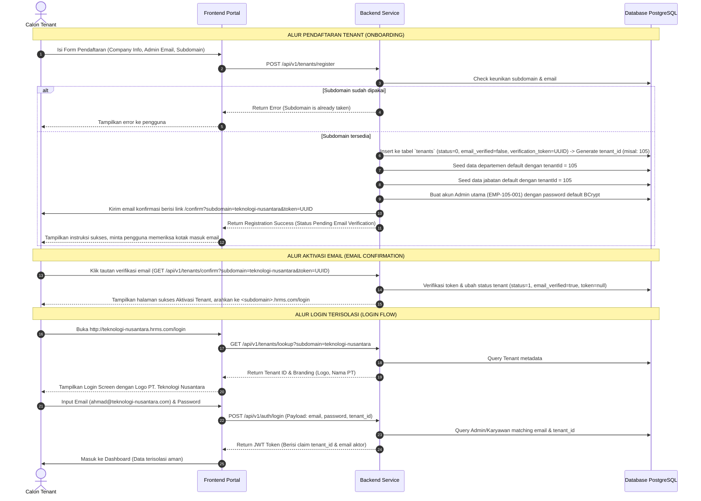
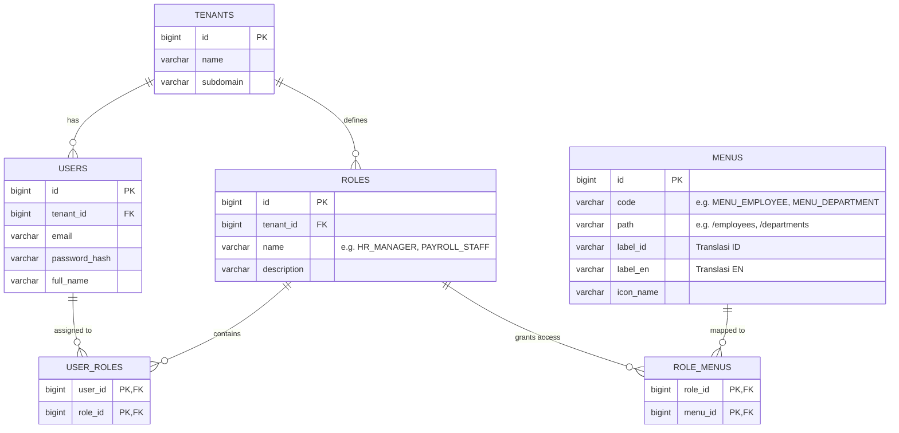
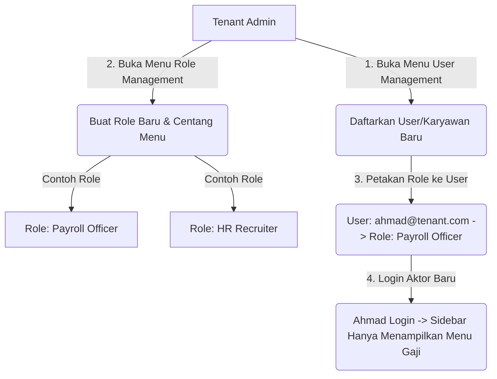

# SaaS Multi-Tenant Registration & Isolated Login Flow

Dalam arsitektur SaaS (Software-as-a-Service) multi-tenant, **Isolasi Data** adalah aspek keamanan paling krusial. Membiarkan tenant melihat daftar tenant lain di halaman login (seperti dropdown simulator saat ini) merupakan celah keamanan informasi (*Cross-Tenant Information Leak*).

Dokumen ini menjelaskan alur pendaftaran tenant baru, data yang wajib diisi, serta mekanisme login yang aman untuk mengisolasi akses pengguna antar tenant secara ketat.

---

## 1. Mekanisme Resolusi Tenant (Isolasi Login)

Untuk mencegah pengguna melihat daftar perusahaan lain, sistem harus menentukan `tenant_id` secara implisit menggunakan salah satu dari dua metode standar industri berikut:

### Metode A: Subdomain Routing (Sangat Direkomendasikan)
*   **Alur:** Pengguna mengakses portal melalui subdomain unik mereka, misalnya:
    *   `teknologi-nusantara.hrms.com` -> Membuka portal PT. Teknologi Nusantara.
    *   `financemandiri.hrms.com` -> Membuka portal PT. Finance Mandiri.
*   **Mekanisme Frontend:** 
    1. Frontend mendeteksi `window.location.hostname` (contoh: `teknologi-nusantara`).
    2. Frontend memanggil API publik `/api/v1/tenants/lookup?domain=teknologi-nusantara`.
    3. Backend memvalidasi domain dan mengembalikan metadata tenant (seperti `tenant_id`, `company_name`, `logo_url`, dan konfigurasi visual tema).
    4. Halaman login dimuat dengan branding khas perusahaan tersebut tanpa mendeteksi keberadaan perusahaan lain.

### Metode B: Email-Based Resolution (Alternatif Simpel)
*   **Alur:** Halaman login global hanya meminta email pengguna terlebih dahulu (Single-Input Screen).
*   **Mekanisme Frontend/Backend:**
    1. Pengguna memasukkan `ahmad@teknologi-nusantara.com`.
    2. Backend memetakan domain email (`teknologi-nusantara.com`) ke `tenant_id` tertentu dalam database.
    3. Sistem melanjutkan ke langkah input password untuk tenant bersangkutan, atau mengalihkan sesi ke login portal tenant yang sesuai.

---

## 2. Alur Pendaftaran Tenant Baru (Onboarding Flow)

Proses pendaftaran tenant baru harus mengumpulkan informasi perusahaan dasar, membuat entitas admin utama, dan menginisialisasi (seed) data dasar tenant baru.

### Informasi yang Wajib Diisi (Form Registrasi):
1.  **Profil Perusahaan (Company Profile):**
    *   `Company Legal Name` (Nama Hukum Perusahaan) - contoh: *PT. Teknologi Nusantara*
    *   `Subdomain Prefix` (Prefiks Subdomain) - contoh: `teknologi-nusantara` (akan dicek ketersediaannya)
    *   `Company Phone` & `Address` (Kontak & Alamat Perusahaan)
2.  **Akun Admin Utama (Primary Admin Account):**
    *   `Admin Full Name` (Nama Lengkap Administrator)
    *   `Work Email` (Email Kerja - akan menjadi username login utama)
    *   `Password` (Kata Sandi)
3.  **Preferensi Tenant (Tenant Preferences):**
    *   `Default Language` (Bahasa Utama: ID/EN)
    *   `Timezone` (Zona Waktu operasional HR)
    *   `Currency` (Mata Uang dasar payroll)

### Mekanisme Provisioning Backend (Saat Registrasi Berhasil):
1.  **Validasi Domain:** Sistem memeriksa keunikan subdomain yang diajukan di database tenant global.
2.  **Pembuatan Tenant ID:** Record baru disimpan ke tabel `tenants` untuk menghasilkan `tenant_id` yang unik.
3.  **Data Seeding Otomatis:** Sistem mengeksekusi script inisialisasi khusus untuk `tenant_id` baru tersebut:
    *   Membuat data Departemen default (contoh: *Human Resource, IT, Finance*).
    *   Membuat data Jabatan default (contoh: *Administrator, Staff*).
    *   Membuat record Karyawan pertama dengan jabatan *Administrator* yang terhubung ke email admin yang didaftarkan.

---

## 3. Diagram Alur Sistem (Flow Diagram)



---

## 4. Mekanisme Keamanan Sesi Dashboard

Setelah login berhasil:
1.  **JWT Token Claim:** Token JWT yang dikembalikan oleh backend harus mencakup claim `tenantId` dan `role` (Admin/User).
2.  **API Gateway / Spring Security Filter:** Setiap request HTTP ke backend wajib membawa JWT. Interceptor backend akan mengekstrak `tenantId` dari token JWT tersebut, bukan dari query parameter request yang bisa diubah oleh pengguna. Hal ini memastikan user tidak bisa memanipulasi parameter di URL untuk mengakses data tenant lain.

---

## 5. Multi-Role & Dynamic Menu Access Control (RBAC)

Ketika suatu tenant memiliki banyak pengguna dengan peran (*role*) yang berbeda-beda (misalnya: HR Manager, Payroll Officer, Super Admin, atau Karyawan Biasa), kita harus mengimplementasikan **Role-Based Access Control (RBAC)** yang bersifat dinamis.

### 5.1 Skema Relasi Database (PostgreSQL)

Setiap role dan hak akses menu dikaitkan dengan `tenant_id` untuk memastikan isolasi penuh. Berikut adalah rancangan tabel ERD untuk mendukung multi-role dan menu dinamis:



### 5.2 Mekanisme Kerja Menu Dinamis

#### 1. Sesi Login (Payload Token & Menu List)
Saat pengguna berhasil login, API Backend `/api/v1/auth/login` akan mengembalikan JWT Token beserta daftar menu yang boleh diakses pengguna tersebut (gabungan dari semua role yang dimiliki):
```json
{
  "token": "eyJhbGciOi...",
  "user": {
    "email": "budi@teknologi-nusantara.com",
    "fullName": "Budi Hartono",
    "roles": ["HR_MANAGER", "RECRUITER"]
  },
  "allowedMenus": [
    { "code": "MENU_EMPLOYEE", "path": "/employees", "icon": "users" },
    { "code": "MENU_DEPARTMENT", "path": "/departments", "icon": "folder" }
  ]
}
```

#### 2. Rendering Dinamis di Frontend (Sidebar & Routing)
*   **Sidebar Rendering:** Komponen `Sidebar.tsx` tidak lagi menulis daftar menu secara hardcoded. Frontend melakukan loop pada array `allowedMenus` dari session state untuk merender tombol navigasi.
*   **Router Guard:** React Router mencocokkan path url saat ini dengan array `allowedMenus`. Jika pengguna mencoba mengakses `/jobs` secara manual lewat URL bar padahal tidak memiliki izin, halaman otomatis mengalihkan ke halaman *403 Forbidden*.

#### 3. Proteksi Endpoint API di Backend (Security Enforcement)
Setiap request API ke Spring Boot dicek oleh Spring Security menggunakan annotation `@PreAuthorize` yang memeriksa authority hasil ekstrak JWT Token:
```java
@RestController
@RequestMapping("/api/v1/departments")
public class DepartmentController {

    @PostMapping
    @PreAuthorize("hasAuthority('MENU_DEPARTMENT')")
    public ResponseEntity<DepartmentResponse> create(
            @RequestBody DepartmentRequest req, 
            @RequestAttribute("tenantId") Long tenantId) {
        // Logika bisnis aman terkunci tenantId & hak akses menu
        return ResponseEntity.ok(service.createDepartment(req, tenantId));
    }
}
```

### 5.3 Contoh Skenario Akses User
*   **User A (Role: HR Admin):** Memiliki role `HR_ADMIN`. Dalam database `ROLE_MENUS`, role ini dikaitkan dengan `MENU_EMPLOYEE` dan `MENU_DEPARTMENT`. Sidebar hanya memunculkan dua menu tersebut.
*   **User B (Role: Payroll Staff):** Memiliki role `PAYROLL_STAFF`. Hanya bisa melihat menu `MENU_PAYROLL`. Jika dia menembak API `/api/v1/employees` atau `/api/v1/departments`, API Gateway/Backend Spring Security akan langsung melempar HTTP 403.

---

## 6. Hierarki Admin & Alur Manajemen Pengguna

Tepat sekali. Di dalam sistem SaaS Multi-Tenant, harus ada pembagian peran administrator antara level **Tenant** (Internal Perusahaan Klien) dan level **Platform** (Penyedia Software/SaaS Owner).

### 6.1 Perbedaan Platform Admin vs Tenant Admin

| Cakupan / Fitur | Platform Admin (SaaS Owner) | Tenant Admin (Super Admin Perusahaan) |
| :--- | :--- | :--- |
| **Akses Data** | Global (Bisa memantau semua tenant) | Lokal (Hanya data di dalam tenant miliknya) |
| **Fungsi Utama** | Onboarding tenant baru, monitoring server, penagihan/billing | Menambahkan karyawan, memanajemen departemen/jabatan, mengatur hak akses |
| **Skema ID** | `tenant_id = 0` atau `SYSTEM_ROLE` khusus | `tenant_id = [ID Unik Tenant]` |

### 6.2 Alur Pembuatan Pengguna Baru & Hak Akses (Internal Tenant)

Ketika pendaftaran tenant baru disetujui, pendaftar pertama secara otomatis ditunjuk sebagai **Tenant Admin** (Super Admin untuk tenant tersebut) dengan hak akses penuh. 

Selanjutnya, alur penambahan karyawan/user baru dilakukan sebagai berikut:



1.  **Registrasi Pengguna Baru:** Tenant Admin mendaftarkan email, nama, dan detail karyawan lainnya di menu *User Management*.
2.  **Pembuatan Role Khusus:** Tenant Admin dapat membuat role khusus (misalnya: *Spv IT* atau *Staff HR*). Pada layar pembuatan role ini, terdapat kumpulan checkbox menu (`MENUS`) yang ada di sistem. Admin mencentang menu apa saja yang boleh dibuka oleh role tersebut.
3.  **Pemetaan Role ke User:** Tenant Admin mengaitkan satu atau beberapa role ke user yang baru didaftarkan tersebut.
4.  **Login Pengguna Baru:** Saat pengguna baru tersebut login, sistem backend akan memfilter hak aksesnya secara dinamis sesuai dengan checklist menu yang dibuat oleh Tenant Admin mereka.

Dengan metode ini, penyedia SaaS tidak perlu ikut campur dalam mengatur hak akses operasional harian perusahaan klien. Masing-masing perusahaan memiliki kendali penuh dan mandiri atas pengguna dan perannya sendiri.

---

## 7. Perbedaan Alur Pendaftaran Tenant Baru vs Pendaftaran Pengelola Internal (Staff)

Terdapat perbedaan mendasar pada status sistem, siapa aktor yang melakukan tindakan, dan output data yang dihasilkan di database ketika mendaftarkan **Tenant Baru** dibandingkan dengan mendaftarkan **Pengelola Internal (User)**.

### Perbandingan Karakteristik Alur

| Aspek | Konteks 1: Registrasi Tenant Baru (SaaS Sign-Up) | Konteks 2: Registrasi Pengelola Internal (User Provisioning) |
| :--- | :--- | :--- |
| **Aktor Pelaksana** | Calon Klien / Pemilik Perusahaan Baru. | **Tenant Admin** yang sudah memiliki hak akses di dalam Dashboard perusahaan. |
| **Status Halaman** | Publik (Halaman registrasi terbuka di landing page utama SaaS). | Privat (Harus login terlebih dahulu, diakses melalui Menu *User Management*). |
| **Data yang Diinput** | Nama Perusahaan, Subdomain yang diinginkan, Email pemilik/pendaftar pertama, Password. | Nama lengkap staf, Email kerja staf, Pilihan Role (misal: HR Staff, Payroll Spv). |
| **Dampak di Database** | 1. Membuat Record Baru di tabel `TENANTS`. <br>2. Membuat skema/data default (`seeding`) departemen, jabatan. <br>3. Membuat user Admin pertama dengan `tenant_id` baru. | 1. Membuat Record Baru di tabel `USERS` dengan `tenant_id` yang sama dengan Admin yang mendaftarkan. <br>2. Menambahkan relasi di tabel `USER_ROLES`. |
| **Output / Hasil** | Ruang kerja (*Workspace*) baru terisolasi (contoh: `klienbaru.hrms.com`). | Akun tambahan yang terikat ke workspace lama untuk membantu operasional. |

---

### Ilustrasi Perbedaan Flow

```
Konteks 1: Registrasi Tenant Baru (SaaS Sign-Up)
[ Halaman Pendaftaran Publik ] 
       │
       ▼ (Backend: generate tenant_id = 120 & seed data default)
[ Buat Subdomain baru: perusahaan-a.hrms.com ]
       │
       ▼
[ Pemilik otomatis login sebagai Super Admin Tenant 120 ]


Konteks 2: Registrasi Pengelola Internal (Staff)
[ Dashboard Admin Perusahaan A (tenant_id: 120) ]
       │
       ▼ (Akses menu User Management)
[ Tambah User Baru: staff-it@perusahaan-a.com ]
       │
       ▼ (Pilih Role: IT_SUPPORT)
[ Staff-IT dapat login ke perusahaan-a.hrms.com/login ]
```

---

## 8. Dashboard Master / Platform Admin (SaaS Provider Console)

Betul sekali! Sebagai pemilik atau pengelola SaaS ini (SaaS Provider), Anda membutuhkan portal terpisah untuk memantau ekosistem aplikasi secara global. Portal ini disebut **Platform Admin Console** atau **Master Admin Portal**.

### 8.1 Skema Data Langganan Tenant (Subscription Tracking)

Untuk mendukung fungsi pemantauan umur tenant dan billing pada PostgreSQL, kita perlu memperluas kolom pada tabel `TENANTS`:

```sql
ALTER TABLE tenants ADD COLUMN status VARCHAR(20) DEFAULT 'ACTIVE'; -- ACTIVE, TRIAL, EXPIRED, SUSPENDED
ALTER TABLE tenants ADD COLUMN plan VARCHAR(20) DEFAULT 'TRIAL';     -- TRIAL, PROFESSIONAL, ENTERPRISE
ALTER TABLE tenants ADD COLUMN joined_at TIMESTAMP DEFAULT NOW();
ALTER TABLE tenants ADD COLUMN expiry_date TIMESTAMP;
ALTER TABLE tenants ADD COLUMN max_employees INT DEFAULT 50;         -- Batas kuota karyawan per tenant
```

### 8.2 Fitur-Fitur Utama Platform Admin Dashboard
Dalam dashboard khusus Anda (`admin.hrms.com`), Anda dapat mengakses modul-modul berikut:

1.  **Overview Analytics (Metrik Utama):**
    *   Total Tenant Aktif vs Habis Masa Berlaku.
    *   Statistik pertumbuhan Tenant Baru (bulanan/mingguan).
    *   Statistik kapasitas (jumlah data karyawan global yang terdaftar).
2.  **Daftar Tenant (Tenant Directory):**
    *   Tabel komprehensif yang menampilkan informasi lengkap setiap tenant:
        *   `Tenant Profile:` ID & Nama Perusahaan.
        *   `Subdomain:` Prefiks subdomain (contoh: `teknologi-nusantara`).
        *   `Primary Admin (Pengelola Tenant):` Nama lengkap & email kontak pemilik akun admin utama.
        *   `Employee Capacity (Jumlah Pegawai):` Jumlah pegawai aktif saat ini dibanding batas kuota pegawai (contoh: **42 / 50 pegawai**). Hal ini dihitung secara real-time melalui query `COUNT` dari tabel karyawan yang difilter per `tenant_id`.
        *   `Masa Aktif & Skema:` Tanggal bergabung (`joined_at`), tanggal kedaluwarsa (`expiry_date`), status berlangganan, serta jenis paket (`plan`).
    *   Fitur interaktif untuk:
        *   Memperpanjang masa aktif langganan secara manual.
        *   Mengubah kapasitas kuota batas pegawai (`max_employees`).
        *   Mereset password admin utama jika diperlukan.
3.  **Sistem Notifikasi & Alert Jatuh Tempo:**
    *   **Alert Otomatis (Cron Job/Scheduler):** Backend Spring Boot menjalankan scheduler setiap hari pukul 00:00 untuk memeriksa tenant yang `expiry_date` kurang dari 7 hari. Sistem akan mengirim email peringatan jatuh tempo secara otomatis ke email admin tenant yang bersangkutan.
    *   **Manual Trigger Alert:** Tombol "Kirim Peringatan" pada dashboard Anda untuk langsung memicu pengiriman email tagihan ke tenant tertentu.
4.  **Suspensi Tenant:**
    *   Tombol untuk mengubah status tenant menjadi `SUSPENDED` or `EXPIRED`. Ketika status ini aktif, semua pengguna di bawah `tenant_id` tersebut tidak akan bisa masuk melewati pintu gerbang login (`/login`) dan akan memunculkan layar tagihan/pembayaran.
