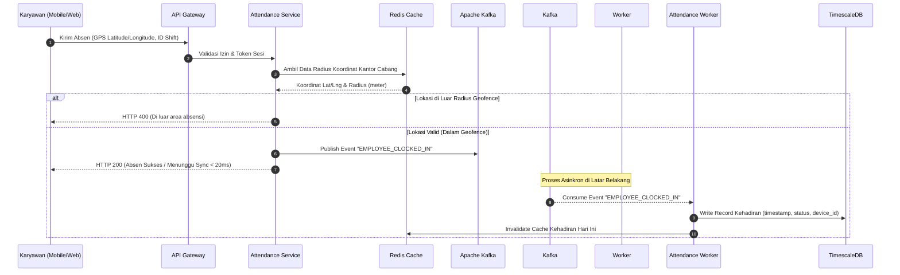
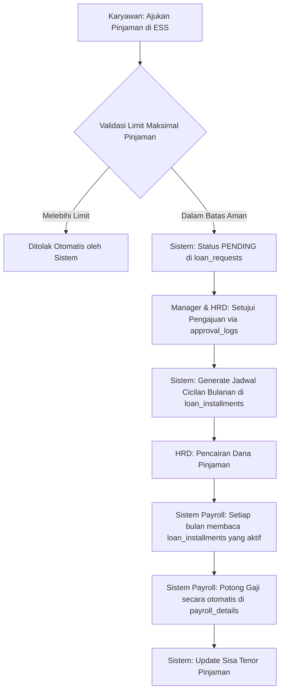

# Spesifikasi Alur Kerja & Peran Pengguna (User Roles & Workflows)
> Dokumen ini menjelaskan pemetaan aktor pengguna, hak akses, serta alur proses bisnis (*business workflows*) terintegrasi untuk seluruh modul **APLIKASI HR** Enterprise.

---

## 1. Pemetaan Aktor Pengguna (User Actors & Roles)

Sistem ini membagi akses data berdasarkan **5 Aktor Utama** dengan deskripsi tanggung jawab sebagai berikut:

| Aktor | Deskripsi Peran | Akses Modul Utama |
| :--- | :--- | :--- |
| **1. Super Admin / IT Admin** | Mengurusi konfigurasi sistem global, hak akses keamanan, dan audit log. | `system_settings`, `users`, `roles`, `audit_logs` |
| **2. HR Admin** | Bertanggung jawab penuh atas administrasi karyawan, penggajian, penjadwalan shift, rekrutmen, dan pelatihan. | `employees`, `payrolls`, `shifts`, `job_postings`, `training_courses` |
| **3. Manager / Team Lead** | Melakukan supervisi tim, menyetujui pengajuan bawahan, serta melakukan penilaian kinerja (OKR & KPI). | `approval_logs`, `okr_objectives`, `project_tasks`, `performance_reviews` |
| **4. Employee (Karyawan)** | Menggunakan portal *self-service* (ESS) untuk absensi harian, klaim, cuti, pinjaman, dan melacak tugas. | `attendances`, `leave_requests`, `claim_requests`, `loan_requests`, `project_tasks` |
| **5. Candidate (Pelamar Kerja)** | Pihak eksternal yang melamar lowongan kerja melalui portal karir perusahaan. | `applicants`, `recruitment_stages` (view status) |

---

## 2. Alur Kerja Utama (Core Workflows)

---

### Workflow A: Absensi Geofencing Asinkron (Attendance Flow)
*   **Aktor Terlibat**: Karyawan (Web/Mobile), Sistem Backend, Kafka Worker, Database.
*   **Tujuan**: Pencatatan absensi yang cepat, aman dari fraud GPS, dan tahan terhadap lonjakan traffic.



---

### Workflow B: Pengajuan Cuti & Workflow Approval Berjenjang
*   **Aktor Terlibat**: Karyawan (Requester), Manager (Approver), HR Admin (Notifier/Reviewer).
*   **Tujuan**: Pengajuan cuti teratur dengan pengurangan kuota cuti otomatis setelah disetujui.

| Langkah | Aktor | Tindakan / Proses | Output Sistem |
| :---: | :--- | :--- | :--- |
| **1** | **Karyawan** | Memilih tipe cuti dan memasukkan rentang tanggal cuti di aplikasi ESS. | Validasi jatah cuti tersisa di `leave_balances`. |
| **2** | **Sistem** | Memeriksa ketersediaan kuota saldo cuti karyawan. | Jika tidak cukup, tolak pengajuan seketika. |
| **3** | **Sistem** | Membuat record di `leave_requests` (status: `PENDING`) dan memetakan rute approval di `approval_routes`. | Menghasilkan log approval awal di `approval_logs`. |
| **4** | **Sistem** | Mengirimkan Push Notification ke HP Manager via Kafka Broker. | Notifikasi muncul di aplikasi Manager. |
| **5** | **Manager** | Membuka detail pengajuan cuti, memberikan catatan, lalu memilih `APPROVE` atau `REJECT`. | Menulis keputusan di `approval_logs`. |
| **6** | **Sistem** | Jika disetujui penuh: Mengurangi kuota cuti di `leave_balances`, mengubah status `leave_requests` menjadi `APPROVED`, dan mengirim notifikasi ke HR & Karyawan. | Saldo cuti ter-update otomatis. |

---

### Workflow C: Pinjaman Karyawan & Potongan Amortisasi Otomatis
*   **Aktor Terlibat**: Karyawan, Manager, HR Admin, Sistem Payroll.
*   **Tujuan**: Pinjaman dana yang disetujui dicairkan, lalu cicilannya dipotong secara otomatis dari payroll bulanan.



---

### Workflow D: Perhitungan Payroll & Kepatuhan Pajak Bulanan (End-of-Month)
*   **Aktor Terlibat**: HR Admin, Sistem Batch Processing.
*   **Tujuan**: Menghasilkan rincian gaji (slip gaji) yang akurat dengan potongan keterlambatan, BPJS, cicilan pinjaman, dan pajak PPh 21.

1.  **Penguncian Absensi (Attendance Freeze)**:
    *   HR Admin mengunci seluruh timesheet kehadiran tanggal 25 setiap bulan. Sistem menghitung total jam kerja, keterlambatan (potongan denda terlambat), dan hari tidak masuk tanpa kabar.
2.  **Kompilasi Variabel Gaji**:
    *   Sistem memanggil Gaji Pokok & Tunjangan Tetap dari `employee_salary_history`.
    *   Sistem memanggil pengajuan cicilan pinjaman aktif dari `loan_installments`.
    *   Sistem memanggil reimbursement yang disetujui bulan ini dari `claim_requests`.
3.  **Kalkulasi Pajak & Iuran Asuransi**:
    *   Sistem menghitung potongan BPJS Kesehatan (1% karyawan, 4% perusahaan) dan BPJS Ketenagakerjaan.
    *   Sistem menghitung **PPh 21 Pajak Penghasilan** secara progresif menggunakan tarif TER (Tarif Efektif Rata-rata) terbaru.
4.  **Generasi Slip Gaji**:
    *   Data rincian di-insert ke `payrolls` dan `payroll_details`.
    *   Status diubah menjadi `DRAFT` untuk diaudit HR Manager sebelum dikirim.
5.  **Distribusi Pembayaran**:
    *   Sistem mengekspor file CSV Bank Transfer (sesuai data `employee_bank_details`) untuk diunggah ke Portal Corporate Banking.
    *   Setelah dikonfirmasi transfer sukses, status diubah menjadi `PUBLISHED`, memicu notifikasi slip gaji digital dikirim ke HP masing-masing karyawan.

---

### Workflow E: Rekrutmen ATS & Otomatisasi Onboarding Karyawan
*   **Aktor Terlibat**: Kandidat Pelamar, HR Admin (Recruiter), Sistem.
*   **Tujuan**: Memproses pelamar kerja dari tahap seleksi administrasi hingga menjadi karyawan aktif dengan hak login.

```
+------------------+     +--------------------+     +-------------------+
|     Kandidat     |     |      HRD/User      |     |   Sistem HRIS     |
+------------------+     +--------------------+     +-------------------+
         |                         |                          |
         | Melamar lowongan        |                          |
         |------------------------>|                          |
         |                         | Proses Seleksi (ATS)     |
         |                         | (Screening, Test, Intv)  |
         |                         |------------------------->|
         |                         |                          | Update status di
         |                         |                          | recruitment_stages
         |                         |                          |
         |                         | Offering Letter Disetujui|
         |                         |------------------------->|
         |                         |                          | 1. Pindahkan data ke
         |                         |                          |    tabel 'employees'
         |                         |                          | 2. Buat akun login
         |                         |                          |    di tabel 'users'
         |                         |                          | 3. Kirim email berisi
         |                         |                          |    kredensial login ESS
         |<---------------------------------------------------|
         | Mendapatkan akses login |                          |
         | ke Web & Mobile ESS     |                          |
```

---

## 3. Matriks Hak Akses CRUD Tabel (RBAC Matrix)

Untuk menjamin keamanan data sensitif karyawan, berikut adalah aturan otorisasi berbasis Role (*Role-Based Access Control*):

| Nama Tabel / Modul | IT Admin | HR Admin | Manager | Employee (ESS) |
| :--- | :---: | :---: | :---: | :---: |
| **`users` / `roles`** | **CRUD** | R | - | - |
| **`employees` (Data Utama)** | R | **CRUD** | R (Hanya Timnya) | R (Hanya Dirinya) |
| **`employee_salary_history`**| - | **CRUD** | - | - |
| **`attendances`** | R | **CRUD** | R (Hanya Timnya) | **CR** (Absen Mandiri) |
| **`payrolls` (Slip Gaji)** | - | **CRUD** | - | R (Hanya Dirinya) |
| **`leave_requests`** | - | **CRUD** | **RU** (Approve Cuti) | **CR** (Ajukan Cuti) |
| **`loan_requests`** | - | **CRUD** | **RU** (Approve Pinjaman)| **CR** (Ajukan Pinjam) |
| **`audit_logs`** | **R** | - | - | - |

> *Keterangan:*
> *   **C**: *Create* (Membuat data baru)
> *   **R**: *Read* (Membaca/Melihat data)
> *   **U**: *Update* (Mengubah status/data)
> *   **D**: *Delete* (Menghapus data)
> *   **-**: *No Access* (Sama sekali tidak memiliki akses kueri)
